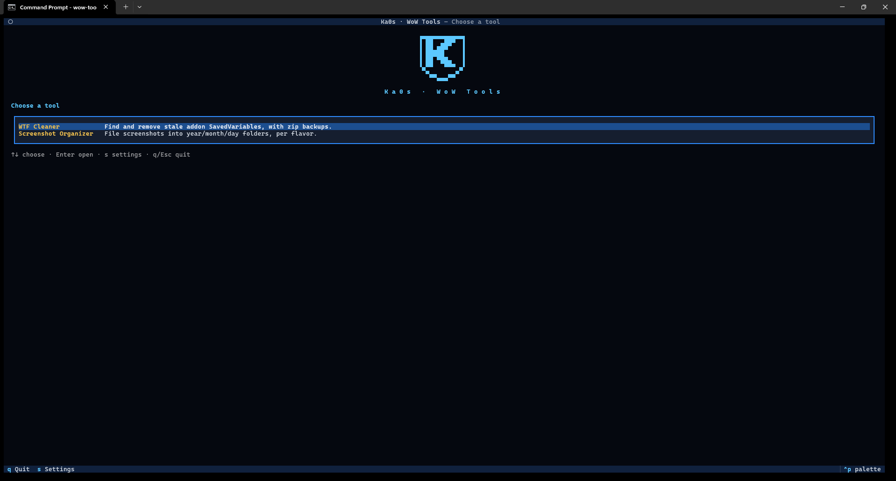
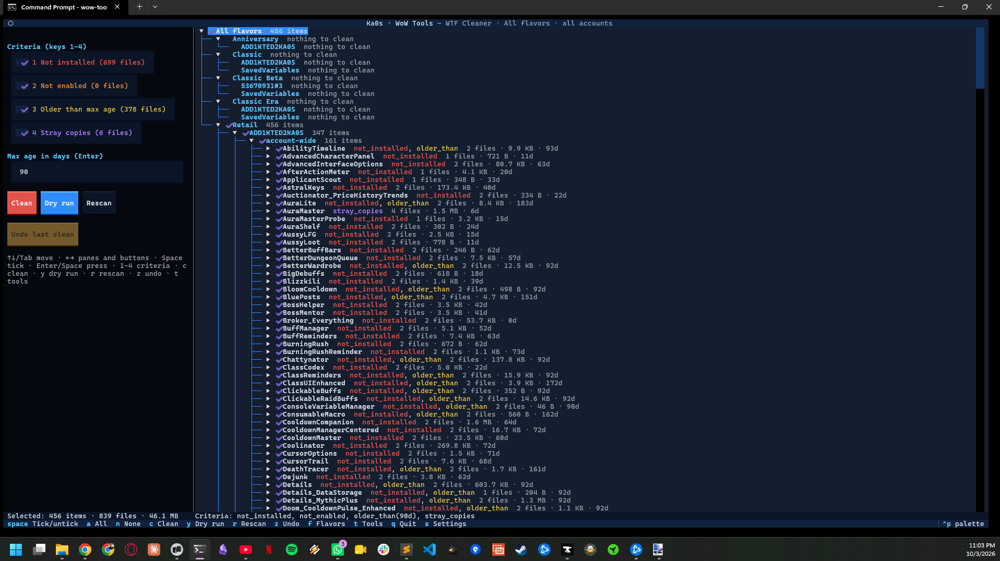
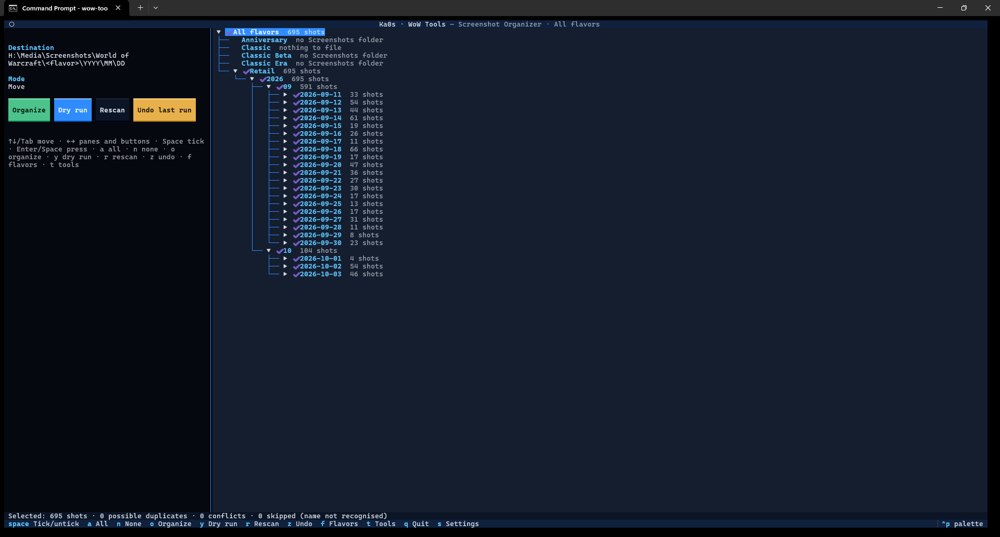

# Ka0s WoW Tools

Ka0s WoW Tools is a small set of World of Warcraft helpers that run ***outside*** the game and tidy up the files WoW
leaves lying around on your computer. It's a single app - you open it, pick a tool from the menu, and when you're done
you land back on the menu.

**_The tool menu_**

## The tools

| Tool | What it does | Guide |
|---|---|---|
| **WTF Cleaner** | Finds settings files left behind by addons you no longer use, backs them up, and deletes them. | [WTF Cleaner guide](docs/wtf-cleaner.md) |
| **Screenshot Organizer** | Sorts your WoW screenshots into folders by year, month and day, one set per game version. | [Screenshot Organizer guide](docs/screenshot-organizer.md) |

Both tools work with every version of the game you have installed: Retail, Classic, Classic Era, Anniversary,
and the PTR and Beta clients. You can work on one version at a time or all of them at once.

Neither tool changes anything until you say so. Each one shows you the full list first and asks before it
touches a file. If you'd rather see what would happen first, do a practice run (a **Dry run**). And if you
change your mind afterwards, you can undo the last run.

## Screenshots

**_WTF Cleaner: the list of leftover addon settings, ready to clean_**

**_Screenshot Organizer: screenshots grouped by day, ready to sort_**

More pictures of every screen are in each tool's guide.

## What you need

You need the following:

1. **World of Warcraft**, duh!
2. **Python 3.10 or newer.** Python is a free program language and interpreter which runs these tools. You install it once.

### Installing Python

**Windows**

1. Go to [python.org/downloads](https://www.python.org/downloads/) and click the big **Download Python** button.
2. Open the file you downloaded.
3. On the first screen, tick **Add python.exe to PATH** (don't skip this one), then click **Install Now**.

You can also get Python from the Microsoft Store: search for "Python 3.12" (or newer) and click **Get**.

**Mac**

1. Go to [python.org/downloads](https://www.python.org/downloads/) and click **Download Python**.
2. Open the downloaded `.pkg` file and follow the steps.

**Linux**

Most Linux systems already have Python. To check, open a terminal and type `python3 --version`. If it shows
3.10 or higher, you're set. If not, install it with your system's package manager, for example:

- Ubuntu or Debian: `sudo apt install python3`
- Fedora: `sudo dnf install python3`
- Arch: `sudo pacman -S python`

**Check that it worked.** Open a terminal (on Windows: press the Windows key, type `cmd`, press Enter) and
type `python --version` on Windows or `python3 --version` on Mac and Linux. You should see something like
`Python 3.12.4`.

That's the only thing you install. Everything else the tools need comes in the download.

## Getting Ka0s WoW Tools

1. Go to the [Releases page](https://github.com/tusharsaxena/wow-tools/releases).
2. Under the newest version, download the **Source code (zip)** file.
3. Unzip it anywhere you like, for example `Documents\wow-tools`.

If you use git, you can clone it instead, which makes updates a single command:
`git clone https://github.com/tusharsaxena/wow-tools.git`

## Getting started

### Running the app

| On | Do this |
|---|---|
| Windows | Double-click `wow-tools.cmd` in the folder you unzipped |
| Mac and Linux | Open a terminal in that folder and type `./wow-tools.sh` |

> **Tip for Windows:** make a shortcut so you don't have to open the folder every time. Right-click
> `wow-tools.cmd`, choose **Show more options**, then **Send to → Desktop (create shortcut)**. Double-click the
> shortcut to start the app. You can also right-click the shortcut and pick **Pin to Start**.

### Navigating the app

The app opens in a terminal window. You drive it with the keyboard:

| Key | Does |
|---|---|
| `↑` `↓` | Move up and down |
| `Enter` | Choose |
| `Esc` | Go back |
| `s` | Settings |
| `q` | Quit |

Each screen lists its keys along the bottom, so you don't have to remember them. A mouse works too.

### The first time

The first time you open a tool, it asks for two things:

1. **Your World of Warcraft folder.** This is the folder that holds `_retail_`, `_classic_` and so on, for
   example `C:\Program Files (x86)\World of Warcraft`. The app looks in the usual places and suggests what it
   finds. You only answer this once; every tool shares it.
2. **That tool's settings.** Each guide explains them. If you're not sure, keep the suggested values.

Then you pick which version of the game to work on, or **All flavors** for every version at once. ("Flavor" is
WoW's word for a game version such as Retail or Classic.)

## Tool guides

Each tool has its own guide, with pictures, that walks through every screen:

- [WTF Cleaner guide](docs/wtf-cleaner.md): clean out old addon settings safely, and undo a clean.
- [Screenshot Organizer guide](docs/screenshot-organizer.md): sort screenshots into dated folders, and undo a
  run.

## Updates

The app checks for a new version once a day while it's open. If there is one, the bottom bar says so; press `u`
to install it. You can also update from a terminal in the app's folder:

- `wow-tools update --check` (on Windows `wow-tools.cmd update --check`, on Mac and Linux
  `./wow-tools.sh update --check`) tells you whether an update is available.
- `wow-tools update` installs it.

Updating never touches your settings, logs or backups. If an update fails partway, the app puts the old version
back.

## Your settings

Your answers are saved in the `config` folder inside the app's folder, one file per tool:

| File | Holds |
|---|---|
| `config\wow-tools.cfg` | Your WoW folder, plus update and log options, shared by every tool |
| `config\wtf-cleaner.cfg` | The WTF Cleaner's settings |
| `config\screenshot-organizer.cfg` | The Screenshot Organizer's settings |

The easiest way to change them is to press `s` in the app. You can also open the files in Notepad while the app
is closed. The guides list every setting.

## Undo and run journals

Every tool that changes files keeps a short record of what it did, called a **journal**, so it can undo its last
run. Journals are kept in your WoW folder, under `wow-tools\<tool name>\journal`. Each tool's guide explains its
undo.

## Logs

The app writes down everything it does, down to every file it deletes or moves. The logs are in the `logs`
folder, one folder per tool, and the `logfile-<date>.log` files are plain text you can open in Notepad. They're
kept for 90 days. If you ever need to report a problem, send these along.

## Windows and WSL

If you use WSL (Linux inside Windows), the same folder works from both sides. Run `./wow-tools.sh` from WSL or
`wow-tools.cmd` from Windows; your settings carry over.

## FAQ

| Question | Answer |
|----------|--------|
| Is it safe? Can I lose anything? | Both tools show you the full list and ask before they change anything. The WTF Cleaner backs up your whole `WTF` folder and zips every file before deleting it, and the Screenshot Organizer never overwrites a file. Both can undo their last run. If you're unsure, press **Dry run** first: it shows what would happen without changing anything. |
| Does it change the game itself? | No. It never touches the game program or your addons. It only works on files the game leaves in your WoW folder: addon settings in `WTF` and pictures in `Screenshots`. |
| Do I need to close WoW? | Close it before you clean with the WTF Cleaner: WoW rewrites those files when you log out and can bring deleted ones back. The cleaner warns you if WoW is running. The Screenshot Organizer doesn't mind if the game is open. |
| Do I need to install anything besides Python? | No. Everything else the app needs comes in the download. |
| Does it work on a Mac? | Yes, with `./wow-tools.sh`. The only thing missing on a Mac is the "WoW is running" warning, so close WoW yourself before cleaning. |
| Why does it say another copy may already be running? | Only one copy of the app can run at once. While it's open it keeps a small file called `wow-tools.lock` in its folder. If you start it a second time, or it crashed last time, you get a warning with two buttons: **Quit** if the app really is open somewhere else, or **Override and continue** if it isn't (for example after a crash). When the app can tell the other copy is gone, it says so and puts you on **Override and continue**. |
| Can I work on all my game versions at once? | Yes. Pick **All flavors** at the top of the list, in either tool. |
| Where are my settings, backups and logs? | Settings are in the app's `config` folder and logs in its `logs` folder. Backups and undo journals are in your WoW folder, under `wow-tools`. See [Your settings](#your-settings) and the guides. |
| How do I update? | The app tells you on its bottom bar when a new version is out; press `u`. See [Updates](#updates). |
| How do I uninstall it? | Delete the app's folder. If you also want the backups and undo journals gone, delete the `wow-tools` folder inside your WoW folder. Nothing else is installed anywhere. |

## Troubleshooting

| Symptom | Fix |
|---------|-----|
| "Python was not found", or nothing happens when I double-click `wow-tools.cmd` | Python isn't installed, or **Add python.exe to PATH** wasn't ticked. Run the Python installer again, choose **Modify**, and tick it. |
| "No WoW flavor folders were found" | Pick the `World of Warcraft` folder itself, not `_retail_` inside it. |
| "Ka0s WoW Tools may already be running" | See *Why does it say another copy may already be running?* in the [FAQ](#faq). |
| The window looks garbled or too small | Make the terminal window bigger, or use Windows Terminal (the default on Windows 11). |
| It's very slow on WSL | WSL (Linux inside Windows) is slow at reading files on Windows drives such as `C:` or `G:`: every file takes a moment to check, and a WoW folder has thousands of them. Start the app from Windows instead, by double-clicking `wow-tools.cmd`. It uses the same settings, so nothing needs setting up again. If you stay on WSL, give the first scan time; the progress bar shows it's still working. |
| A tool does something unexpected | See the troubleshooting table at the end of that tool's guide. |
| Something looks wrong and I want to report it | Follow [Reporting a bug](#reporting-a-bug) below. |

## Reporting a bug

- Note what you did and what you expected to happen.
- Open the `logs` folder inside the app's folder, then the folder of the tool you were using (for example
  `logs\wtf-cleaner`).
- Attach that day's `logfile-<date>.log` and `events-<date>.log` to your report.

The logs list every step the app took, so they usually show what went wrong.

## Issues and feature requests

Bugs, ideas and planned work all go in the GitHub issue tracker:
[https://github.com/tusharsaxena/wow-tools/issues](https://github.com/tusharsaxena/wow-tools/issues).
Please file reports there, so nothing gets lost.

## Version History

| Version | Date | Highlights |
|---------|------|------------|
| 1.0.0 | 2026-10-04 | - First release, with two tools in one app - **WTF Cleaner**: finds settings left behind by addons you no longer use, shows them for review, backs them up and deletes them; works on one game version, one account or **All flavors**; **Dry run** and **Undo last clean** - **Screenshot Organizer**: sorts screenshots into year, month and day folders, in place or into an archive folder; duplicate checks, copy mode, **Dry run** and **Undo last run** - Works with every installed game version (Retail, Classic, Classic Era, Anniversary, PTR and Beta) on Windows, Mac, Linux and WSL - Checks for updates and installs them for you |

## Credits

The app's screens are built with [Textual](https://github.com/Textualize/textual) and
[Rich](https://github.com/Textualize/rich) by Textualize (MIT license). They ship inside the app, together with
the small libraries they use: Pygments (BSD 2-Clause), markdown-it-py, mdit-py-plugins, mdurl, linkify-it-py and
platformdirs (all MIT), and typing_extensions (PSF license).

## License

Ka0s WoW Tools is released under the [MIT License](LICENSE). You're free to use, copy, change and share it.
