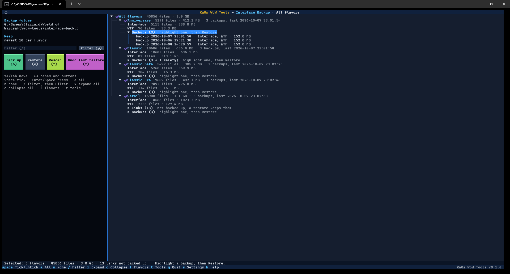
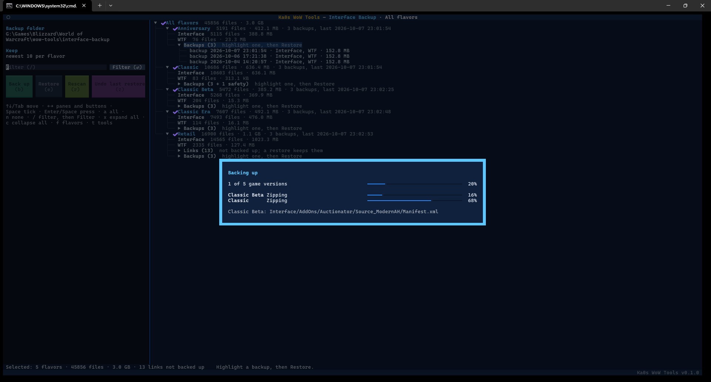
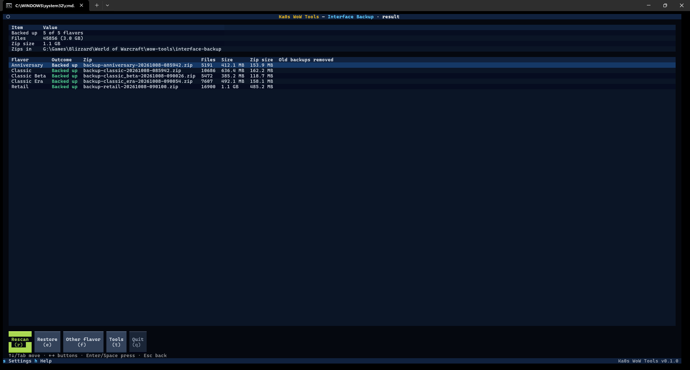
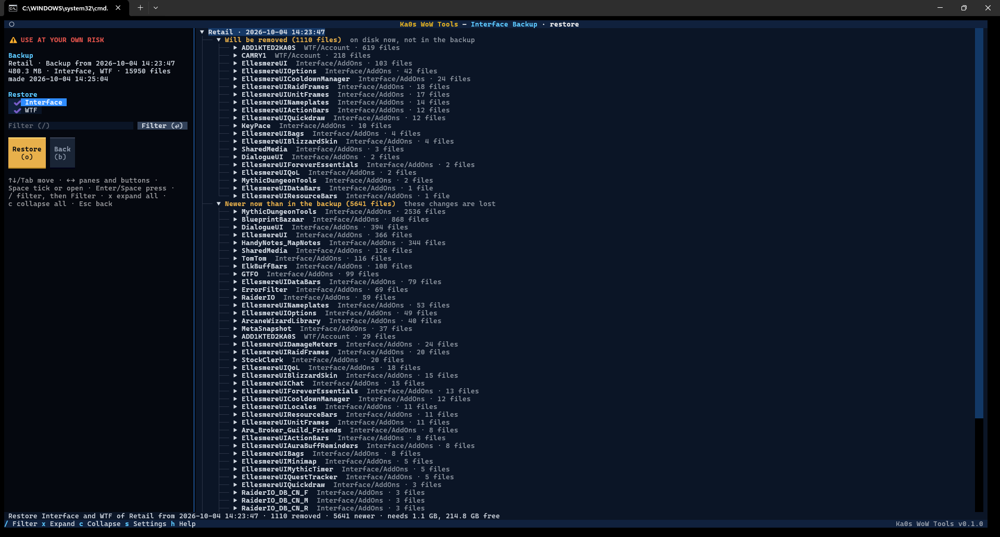
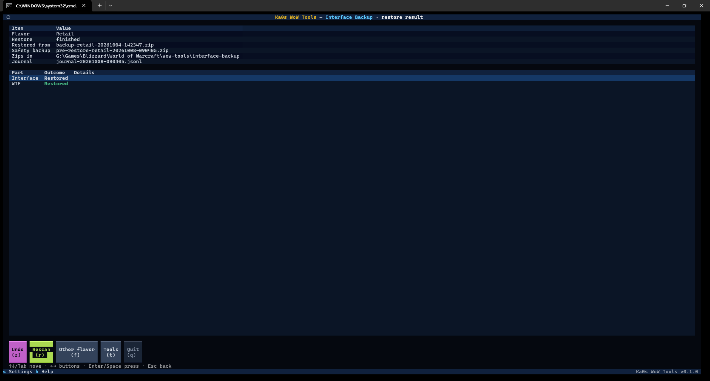
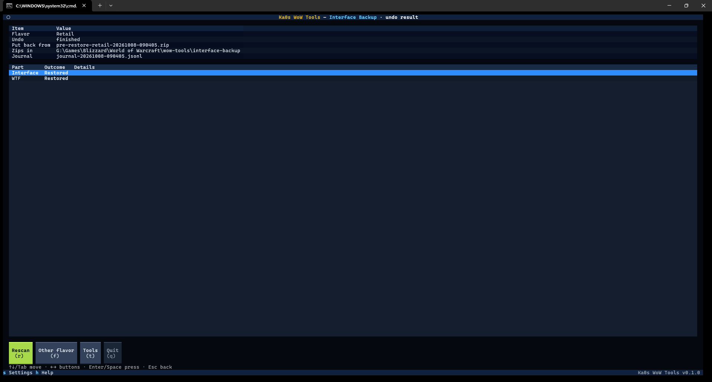

# Interface Backup guide

[← Back to the main page](../README.md)

Each game version keeps your addons in its `Interface` folder and their settings (and yours: keybindings, macros,
chat setup) in its `WTF` folder. An addon update that breaks things, a reinstall, or a settings file that got
wiped can cost you an evening of putting it all back together.

Interface Backup zips those two folders into one dated zip per game version. When something goes wrong, you pick
a zip and put the folders back exactly as they were. Before every restore it takes a safety backup of the folders
as they are, so you can undo the restore too.

> **Close WoW before you restore.** WoW rewrites `WTF` when you log out, and an open game can lock files in
> `Interface`. Interface Backup warns you if WoW is running. A backup works with the game open, but it may miss
> your latest settings.

## Step by step

### Making a backup

1. Start Ka0s WoW Tools and choose **Interface Backup**.
2. **The first time only:** check the settings (see [Settings](#settings)) and press **Save**. The suggested
   values are fine for most people.
3. **Pick a game version**, or **All flavors** to back up every version at once. `t` or `Esc` goes back
   to the tool menu.
4. The review screen counts what your `Interface` and `WTF` folders hold. Untick any game version you want to
   leave out.
5. Press **Back up** (`b`), read the summary, and press **Yes**.
6. The results screen shows each zip, its size, and how many old backups were removed.

### Restoring a backup

1. On the review screen, open a game version's **Backups** line in the tree (`Enter`) and highlight a backup.
2. Press **Restore** (`e`), or `Enter` on the backup.
3. Tick **Interface**, **WTF** or both, and read what the restore would remove or change.
4. Press **Restore** (`o`), read the summary, and press **Yes** (selected, in red).
5. The results screen shows what happened to each folder. If you don't like the result, press **Undo** (`z`).

`t` goes back to the tool menu and `q` quits from any screen, except while a backup or restore is running.

## Where your backups go

Unless you change it in settings, the backup folder is `<your WoW folder>\wow-tools`. Zips go into the
`backup` folder of its `interface-backup` folder:

```
<backup folder>\interface-backup\backup\
  backup-<flavor>-<YYYYMMDD-HHMMSS>.zip         your Interface and WTF folders
  pre-restore-<flavor>-<YYYYMMDD-HHMMSS>.zip    a safety backup, taken just before a restore
<your WoW folder>\wow-tools\interface-backup\
  journal\journal-<YYYYMMDD-HHMMSS>.jsonl        the record Undo uses
```

Earlier versions put the zips straight into `interface-backup`. The first time you open the review, they're moved into
its `backup` folder. A zip that can't be moved (one of the same name is already in `backup`, or the move fails) stays
where it is, and the log says so once per session. It's still listed, restored and cleaned up like the others. The
app tries the move again each time the review scans (when you open it, or press `r`). If the name was already taken in
`backup`, Backups lists two zips with that name: look at both, then move or delete the old one in `interface-backup`
yourself.

`<flavor>` is the game version (`retail`, `classic_era` and so on). For example:
`backup-retail-20261004-201530.zip`. If two backups start in the same second, the second gets `-2` added before
`.zip`, so no backup ever replaces another. The journals always stay in your WoW folder, even if you pick another
backup folder.

Inside a zip you find the `Interface` and `WTF` folders, exactly as they are in the game version's folder, plus a
small `manifest.json` that lists every file. The app uses the manifest to check the zip before it restores
anything.

- After each backup, only the newest 10 **backups** of that game version are kept (you can change this in the shared
  settings, the first screen `s` opens; `0` keeps every backup). Older ones are deleted, and only after the new zip has
  been checked.
- A **safety backup** is kept as long as the journal of its restore is kept: the newest 10 restores, unless you
  change the journals to keep in the shared settings. They don't count towards the backups to keep.
- Files in that folder that the app didn't make are never touched.

## Picking a game version

The list shows every game version in your WoW folder, with **All flavors** at the top. Next to each one you see
how many backups it has and when the newest was made, or "no backups yet". The notes take a moment to appear
("checking…"), but you can pick straight away. Your choice is remembered for next time.

## The review screen

**_The Interface Backup review screen_**



The review screen looks like the other tools' review screens: a panel on the left, a tree on the right, and a bar
at the bottom.

**On the right** is a tree of the game versions you picked:

game version → `Interface`, `WTF`, links, warnings and **Backups** → one line per backup

The top line is **All flavors** (or the game version you picked), with the files and size of everything ticked.
Each game version's line shows what a backup of it would hold (files and size) and its backups ("2 backups, last
2026-10-04 20:15:30", or "no backups yet"). A version with nothing to back up says why instead ("nothing to back
up: no Interface or WTF folder"), and its backups only when it has some. Under it:

| Line | Shows |
|---|---|
| **Interface** | How many files your `Interface` folder holds, and their size. "missing" when there is no such folder, "link, skipped" when the folder is a link (see [Links and junctions](#links-and-junctions)) |
| **WTF** | The same for `WTF` |
| **Links (N)** | Linked folders or files found inside. They're not backed up, and a restore keeps them. Open the line to see them |
| ⚠ **Left from an interrupted restore** | A folder an interrupted restore left behind. Restores of this game version are blocked until you deal with it (see [If a restore was interrupted](#if-a-restore-was-interrupted)) |
| ⚠ **Scan warnings (N)** | Places the app couldn't read, so they're not backed up. Open the line to see them, or press `!` for the [warnings view](#scan-warnings) |
| **Backups (N)** | The game version's backups. Safety backups are counted apart: "Backups (2 + 1 safety)". Open the line to list them, newest first |

Each backup's line says **backup** or **safety** (a safety backup, taken before a restore), the date and time, what the
zip holds and its size, for example `backup 2026-10-04 20:15:30 · Interface, WTF · 84.2 MB`. What the zip holds fills in
a moment after you open the list ("…" until then): "Interface, WTF", "Interface", "WTF", "none" (a safety backup taken
when the restored folder didn't exist yet), or "?" when the zip can't be read.

Every game version starts ticked, meaning "back this up". Ticks are on game versions only: a backup always holds
a version's whole `Interface` and `WTF` folders. A game version with nothing to back up (no `Interface` or `WTF`
folder, or only links) has no tick, and its line says why.

**On the left** you see where backups go (**Backup folder**), how many are kept (**Keep**: "newest 10 per flavor"
or "all backups"), the buttons and the keys.

**At the bottom** a bar totals what's ticked ("Selected: 2 flavors · 12408 files · 412.0 MB · 3 links not backed
up"). When a backup is highlighted, it names that backup in full, with its date and time; otherwise it says how
to pick one. It also warns when a restore is blocked.

To filter the tree, press `/` to reach the filter box on the left. Type part of a name: a game version, a link, a
warning or a backup's date and time (`2026-10-04`). Upper or lower case doesn't matter. Then press `Enter` or click the
**Filter** button beside the box; typing alone changes nothing. The tree keeps the matching lines and the game versions
they're in, and opens a **Backups** (or **Links**) line when something in it matches. A game version stays shown, and
tickable, while anything in it matches. Applying an empty box shows everything again, and `Esc` in the box clears the
filter. The filter only changes what you see. `a` and `n` act on the game versions shown, but a ticked one the filter
hides is still backed up, and the bottom bar and the confirmation tell you ("1 selected flavor is hidden by the
filter").

On Windows you see file counts and sizes. From WSL, Mac or Linux the review shows file counts only: reading
every file's size there takes a disk round trip per file, and an `Interface` folder can hold tens of thousands of
files. The backup itself works the same, and the results screen shows the sizes.

### Keys on the review screen

| Key | Does |
|---|---|
| `Space` | Tick or untick the highlighted game version (or the top line, for all of them) |
| `a` / `n` | Tick / untick every game version shown |
| `/` | Filter the tree (see below) |
| `Enter` | Open or close the highlighted line; on a backup, **Restore** it |
| `b` | **Back up** the ticked game versions (asks first; **Yes** is selected, red when older backups are deleted to keep the number set, green when all are kept) |
| `e` | **Restore** the highlighted backup |
| `x` / `c` | Expand every line of the tree / collapse them all |
| `!` | Open the [scan warnings](#scan-warnings) (only while there are any; the **⚠ … (!)** button at the bottom does the same) |
| `r` | **Rescan**: scan again |
| `z` | **Undo last restore** (asks first; **Yes** is selected, in red) |
| `f` or `Esc` | Pick another game version |
| `t` | Back to the tool menu (from any screen or popup; not while a backup or restore is running) |
| `s` | Settings |
| `h` | Help: this tool's keys and steps, with a link to this guide |
| `q` | Quit (from any screen; not while a backup or restore is running) |
| `←` `→` | Jump between the tree and the left panel |
| `Tab` | Move to the next control |

**Back up** is greyed out when none of the game versions you picked has an `Interface` or `WTF` folder (the
filter doesn't change this). **Undo last restore** is greyed out when there's no restore to undo. While the screen
scans, or checks whether WoW is running, every button waits.

If you change the settings, press `r` to scan again with them.

### Scan warnings

When the scan skipped something it couldn't read, a **⚠ N scan warnings (!)** button sits at the right end of the
bottom bar: click it or press `!` to open the **warnings view**. It lists every warning, grouped by game version,
each with its part (`Interface` or `WTF`) and what went wrong; the line on the left shows the highlighted one in
full. `/` filters the list, `x` / `c` expand and collapse it, `h` opens the help, **Back** (`Esc`) returns to the
review, `t` goes to the tool menu and `q` quits. With no warnings there's no button. The warnings are in the log
too. The restore screen has the same button for its own scan of the game version.

## Backing up

When you press **Back up**, the bottom bar says "Checking for running programs…" for a moment while it looks for
WoW. Then it asks you to confirm, showing how many files from which game versions, where the zips go and how many
old backups are kept. Two warnings can appear in red:

- **WoW appears to be running.** You can still go ahead, but WoW rewrites `WTF` when you log out, so the backup
  may miss your latest settings.
- **The backup drive may be short of space.** The free space is less than the size of your folders (zipping
  usually makes them a lot smaller, so the backup may still fit). This needs the sizes, so it only shows on
  Windows.

**_A backup in progress_**



Once you confirm, a progress window shows the game version, the step ("Zipping", "Verifying the zip", "Removing
old backups") and the file it's working on. For each game version, the app:

1. Writes the zip under a temporary name (`.partial`), so a half-written zip never looks like a backup.
2. Reads every file back from the zip and checks it against the original sizes.
3. Gives the zip its real name.
4. Only then deletes that game version's oldest backups beyond the number you keep.

If anything goes wrong, the temporary zip is deleted and that game version is marked **Failed**. The others still go
ahead (several may be backed up at once, see Settings). An unexpected error also marks only that game version
**Failed**, and the rest carry on. A backup never changes anything in your game folders.

A file that disappears while it's being zipped (WoW or an addon updater deleted it) is left out, and the results
say how many. A file that's locked by another program stops that game version's backup; close the program and
try again.

### The backup results

**_The results of a backup_**



The top table sums up the backup: how many game versions were backed up (and how many failed), the files and
their size, the zips' total size, the folder they're in, and how many old backups were removed. The table below
has a row per game version: **Backed up** or **Failed**, the zip's name (or the reason), the number of files,
their size, the zip's size and how many old backups were removed.

From here, `r` (or `Esc`) goes back to the review and scans again, `e` goes back to the review screen with the
newest backup highlighted (after several game versions, the last one made; the filter is cleared; press `e` or
`Enter` there to restore it), `f` picks another game version, `t` goes back to the tool menu, and `q` quits.

## Restoring

A restore puts a game version's `Interface` folder, its `WTF` folder, or both back **exactly** as they are in the
backup. Files that are there now but not in the backup are removed. Files that changed since the backup go back to
the backup's copy.

### Choosing a backup

On the review screen, open the game version's **Backups** line, highlight a backup and press **Restore** (`e`, or
`Enter` on the backup). The bottom bar names the highlighted backup in full ("Backup from 2026-10-04 20:15:30 ·
Interface, WTF · 84.2 MB: Restore puts it back"). If no backup is highlighted, `e` tells you how to pick one.

A safety backup (its line starts with **safety**) can be restored like any other backup. That's how you go back
to the folders as they were before an older restore.

### The restore screen

**_The restore screen_**



The restore screen has the same shape as the review screen.

**On the left**, under a red `⚠ USE AT YOUR OWN RISK` line (a restore overwrites your folders) and **Backup**, are the
game version, the kind of backup ("Backup", or "Safety backup (before a restore)") and its date, then its size, what it
holds and how many files (and when the zip itself says it was made, if that differs). Under **Restore** are two boxes,
**Interface** and **WTF**, both ticked to start with:

- A folder the backup doesn't hold says "(not in this backup)" and can't be ticked.
- A folder that is itself a link says "(link: restore by hand)" and can't be ticked. See
  [Links and junctions](#links-and-junctions).

Below them are the filter box (`/`) with its **Filter** button, then **Restore** (amber: it overwrites files) and
**Back**. The filter only narrows the tree on the right (type part of a folder or file name: `WeakAuras`, then
`Enter` or **Filter**); it never changes what is restored. `Esc` in the box clears it.

**On the right** is a tree of what the restore would cost you, compared with your folders as they are now. It's
worked out again each time you tick or untick a box ("Comparing the backup with your folders…" meanwhile):

| Line | Means |
|---|---|
| **Will be removed (N files)** | Files you have now that the backup doesn't. They're grouped by folder, largest group first (for example `WeakAuras  Interface/AddOns · 312 files`); open a group to see its files. Usually these are addons you installed after the backup |
| **Newer now than in the backup (N files)** | Files that changed after the backup was made, such as settings you changed since. These changes are lost |
| **Links kept (N)** | Links that stay as they are |
| **Links replaced (N)** | A link where the backup holds real files. Only the link goes, never what it points at, and Undo makes it again |
| **Could not be read (N)** | Folders the app couldn't look into. Whatever they hold is replaced too, without being listed |
| ⚠ **Low disk space** | The WoW drive has less free space than the restored folders need |

The first two start open, the others open with `Enter` or `Space`. The warnings are in amber. If nothing would be
lost, the tree says so: "Nothing on disk would be lost".

**At the bottom** a bar sums it up: "Restore Interface and WTF of Retail from 2026-10-04 20:15:30 · 312 removed · 4
newer · needs 120.0 MB, 30.5 GB free". When its scan of the game version couldn't read something, a
**⚠ N scan warnings (!)** button at the right end opens the [warnings view](#scan-warnings) (`!` too).

| Key | Does |
|---|---|
| `Space` | Tick or untick the highlighted box, or open a line of the tree |
| `o` | **Restore** the ticked folders (asks first) |
| `/` | Filter the tree (only what you see: the restore is the same) |
| `x` / `c` | Expand every line of the tree / collapse them all |
| `b` or `Esc` | Back to the review screen |
| `!` | Open the [scan warnings](#scan-warnings) (only while there are any) |
| `s` | Settings |
| `h` | Help: this tool's keys and steps, with a link to this guide |
| `t` | Back to the tool menu (not while the restore is running) |
| `q` | Quit (not while the restore is running) |
| `←` `→` | Jump between the tree and the left panel |
| `↑` `↓` `Tab` | Move between the boxes and buttons |

**Restore** stays greyed out while the comparison is still running, and when no box is ticked. If the restore is
blocked (a folder left from an interrupted restore, a backup of another game version, or a zip that can't be
read), the boxes are unticked and greyed out, and the tree and the bottom bar say why.

The restore screen reads each file's date to find the newer ones, so on WSL it takes longer than the review
screen's scan.

### Confirming

After the running-WoW check, the app asks "Replace Interface and WTF of Retail with the backup from …?". It
reminds you that a safety backup is taken first, and repeats the warnings, one line each, in red. One more can
appear here: **The backup drive may be short of space for the safety backup**, when the backup folder's drive
has less free space than the folders you ticked take now (the safety zip is usually a lot smaller). If WoW appears to
be running, that's in red too: close it first. **Yes** is selected, in red.

### What happens during a restore

A progress window shows each step. For the game version you picked, the app:

1. **Starts a journal**, the record Undo uses. If it can't write the journal, nothing is changed.
2. **Checks the backup**: it reads every file in the zip. If the zip is damaged, nothing is changed.
3. **Takes a safety backup** of the folders you ticked, as they are right now, as
   `pre-restore-<flavor>-<YYYYMMDD-HHMMSS>.zip`, and checks it. If that fails, nothing is changed.
4. For each folder you ticked:
   - Unpacks the backup into a new folder next to it, `Interface.restoring` (or `WTF.restoring`).
   - Moves the links you keep into the new folder.
   - Renames your current folder to `Interface.replaced`, and the new one to `Interface`.
   - Deletes `Interface.replaced`, without ever following a link inside it.
5. Deletes old journals, and the safety backups only they named, beyond the number you keep.

If a folder can't be swapped (WoW or another program has a file open, say), that folder is put back exactly as it
was and the restore carries on with the other one. Your folders are never left half-copied: the old folder is
swapped out in one rename only after the new one is complete.

### The restore results

**_The results of a restore_**



The top table says which game version, whether the restore finished, the zip it restored from, the safety
backup's zip, the folder (or folders) the zips are in, and the journal's name. The table below has a row per folder:

| Outcome | Means |
|---|---|
| **Restored** | The folder is now exactly the backup's copy |
| **Restored (old copy left)** | Restored, but the old copy (`<folder>.replaced`) couldn't be fully deleted. Delete it yourself; see [If a restore was interrupted](#if-a-restore-was-interrupted) |
| **Left as it was** | The folder couldn't be replaced, so it was put back as it was. The Details column says why |
| **Failed** | Something went wrong and the folder may not be exactly as it was. The Details column says what's where |

From here, `z` undoes this restore (only shown when it replaced a folder that Undo can put back), `r` (or `Esc`) goes
back to the review and scans again, `f` picks another game version, `t` goes back to the tool menu, and `q` quits. An
undo has the same results screen, without `z`.

## Undo

Changed your mind? **Undo last restore** (`z`, the violet button on the review screen, or **Undo** on the
restore results) puts the folders that the most recent restore replaced back as
they were before it, from that restore's safety backup. It asks first, naming when that restore ran, which folders
and which game version. **Yes** is selected, in red.

- Undo works on the most recent restore that changed a folder, whichever game version you picked on the flavor
  screen. A restore that left every folder as it was is passed over, so Undo then offers the restore before it
  (its confirm names when that restore ran), unless that one was already undone.
- A folder the restore created (the game version had no `WTF` folder before, say) is removed again.
- Anything you changed since the restore, in those folders, is lost. Undo doesn't take another safety backup.
- Links are kept, just as in a restore. A link the restore removed (where the backup held real files) is made
  again, pointing where it did. If one can't be made again, that folder shows **Failed** and the Details column
  names the link and where it pointed, so you can make it by hand.
- Undo only goes back **one restore**. After you undo, the button stays greyed out until your next restore. To go
  back further, restore an older restore's safety backup from the game version's **Backups** (its line starts
  with **safety**).
- If no folder could be put back (WoW had files locked, say), the undo doesn't count: close WoW and press
  **Undo last restore** again.

Before it changes anything, Undo checks that the safety backup is still there and reads back every file in it. If
something's wrong, it says why and changes nothing.

**_The results of an undo_**



## Links and junctions

Some people, often addon authors, link an addon folder in `Interface\AddOns` to a folder somewhere else, such as
a git checkout. On Windows that's a junction or a symbolic link; on Mac and Linux a symlink. Interface Backup
never follows a link:

- **A backup** leaves links out. The review screen lists them under the game version's **Links** line, the
  bottom bar counts them, and the log lists up to 20 of them. What a link points at is yours to back up.
- **A restore** keeps your links where they are. The one exception: if the backup holds real files at the same
  place, the link is removed (never what it points at) to make room, and the restore screen warns you first.
  **Undo** makes that link again.
- **Deleting** an old copy (`<folder>.replaced`) removes links inside it as links, without going into them.
- **If `Interface` or `WTF` is itself a link** (you moved the whole folder to another drive, say), it's left out
  of backups, shown as "link, skipped", and the restore screen won't tick it. A game version whose folders are
  both links has nothing to back up: it has no tick, and its line says why. To restore such a folder, close WoW,
  open the zip, and extract its `Interface` (or `WTF`) folder into the place the link points at. Extracting adds and
  overwrites files but doesn't remove extra ones.

## If a restore was interrupted

If the app is closed in the middle of a restore (a power cut, or you closed the window), or an old copy couldn't
be deleted, folders called `Interface.restoring`, `Interface.replaced`, `WTF.restoring` or `WTF.replaced` can be
left next to the real ones in the game version's folder. The app never repairs them on its own. Instead the
review screen shows each one, in amber, under its game version ("Left from an interrupted restore: …"), the bottom
bar says "Restore blocked for …", and **restores and undos of that game version are blocked** until you deal
with it.

Close WoW, open the game version's folder (for example `World of Warcraft\_retail_`), and look at what's there
for the folder in question (here `Interface`; `WTF` works the same way):

| What you find | What happened | Fix |
|---|---|---|
| `Interface` and `Interface.replaced` | The restore finished; only the old copy wasn't deleted | Delete `Interface.replaced`. The safety backup holds the same files |
| `Interface` and `Interface.restoring` | It stopped while unpacking; `Interface` was never touched | Delete `Interface.restoring` |
| `Interface.replaced` and `Interface.restoring`, but no `Interface` | It stopped between the two renames | Rename `Interface.replaced` back to `Interface`, then delete `Interface.restoring` |
| Only `Interface.replaced` | It stopped part-way through the swap | Rename `Interface.replaced` back to `Interface` |
| Only `Interface.restoring` | The game version had no `Interface` folder before the restore | Delete `Interface.restoring` |

In short: if `Interface` is there, the extra folders can go; if it's missing, rename `Interface.replaced` back to
`Interface`.

Before you delete a `.restoring` or `.replaced` folder, check whether it holds any of your linked addon folders
(Windows Explorer shows them with a shortcut arrow). Move those back into `Interface\AddOns` first. If you're not
sure, move the leftover folder somewhere outside the WoW folder (your desktop, say) instead of deleting it.

Then press `r` on the review screen. Once the warning is gone, restore and undo work again. If your folders aren't
how you want them, restore a backup or the restore's safety backup from the game version's **Backups**.

## Settings

Press `s` in the tool (you get the shared settings first: WoW folder, backups and journals to keep, game versions
to work on at once; then this tool's settings). The tool's settings are saved in
`config\interface-backup.cfg`.

| Setting | Starts as | What it means |
|---|---|---|
| Backup folder | empty | Where zips go: they're put in its `interface-backup\backup` folder. Empty means `<WoW folder>\wow-tools`. The line under the box shows where zips will go as you type. It must be a full path (such as `D:\WoW backups`), and it can't be your WoW folder itself or inside a game version's `WTF`, `Interface` or `Screenshots` folder |

The file itself uses these names, if you edit it by hand: `backup_dir` and `last_flavor_choice` (the game version you
picked last time; empty means **All flavors**). The backup folder is checked again before every backup and restore, in
case the file was edited by hand. Close the app before editing the file, or your change may be overwritten. Comments
you add to the file aren't kept (the app rewrites it when it saves a setting or the game version you pick).

Backups and journals to keep, and game versions to work on at once, are shared by every tool: they're on the first
screen `s` opens (the one with your WoW folder), and saved as `keep_backups` (10; `0` keeps all), `keep_journals` (10)
and `parallelism` (2, from 1 to 8; use 1 on a hard drive or a WSL `/mnt` folder) under `[general]` in
`config\wow-tools.cfg`. When you back up several game versions, up to `parallelism` of them are zipped at once, and
their folders are read the same way. Each gets its own zip, one failing never stops the others, and the progress
window shows a row for each one being backed up. A restore is always one game version. Restore journals follow
`keep_journals`, and each keeps its safety backup.

If you move the backup folder, move the zips in its `interface-backup\backup` folder along with it, or the app
won't find them. Undo needs the safety backup in the folder the settings name.

## FAQ

| Question | Answer |
|----------|--------|
| Do I need to close WoW first? | For a restore or an undo, yes: WoW rewrites `WTF` when you log out and can lock `Interface` files. For a backup it's better to, since the backup could miss your latest settings, but it's not required. The app warns you either way, on Windows, WSL, Mac and Linux. |
| What exactly is in a backup? | Everything in the game version's `Interface` and `WTF` folders: your addons, their settings, and your own keybindings, macros, chat and UI layout. Links (see [Links and junctions](#links-and-junctions)) are left out. Nothing else from the WoW folder is included. |
| Is there a Dry run? | No need: a backup only reads your folders. Before a restore, the restore screen lists everything it would remove or change, and nothing happens until you confirm. |
| How much space do backups take? | It depends on your addons. Addon files and settings are text, so a zip is often a fraction of the folders' size. The backup results show both. The newest 10 per game version are kept, plus a safety backup for each of the last 10 restores; both numbers can be changed in the shared settings. |
| Can I restore just one addon, or one file? | Not from the app: it restores whole folders. To get one addon back, close WoW, open the zip, and extract its folder (for example `Interface\AddOns\WeakAuras`) into the game version's folder. |
| Can I restore a Retail backup into Classic? | No. A backup only restores into the game version it came from. |
| Can I undo a restore from last week? | **Undo last restore** only goes back to the most recent restore. For an older one, restore its safety backup: open the game version's **Backups** on the review screen; its line starts with **safety**. |
| Does it back up on its own, on a schedule? | No. It only backs up when you press **Back up**. |
| Can I open the zips myself? | Yes. They're ordinary zip files. Don't add or remove files in them, though: the app checks every file against the zip's `manifest.json` and refuses a zip that doesn't match. |
| Why does the review screen show no sizes? | You're on WSL, a Mac or Linux. Reading every file's size there takes a disk round trip per file, so the review screen counts files only. The backup results show the sizes. |

## Troubleshooting

| Symptom | Fix |
|---------|-----|
| "WoW appears to be running" | Close WoW and try again. For a backup you can go ahead anyway, but your latest settings may be missing from it. |
| "The backup drive may be short of space" or "Low disk space" | Free up some space, or pick a backup folder on another drive in settings (`s`). It's a warning, not a block. A restore needs room on the WoW drive for the unpacked copy next to your current folders, and room on the backup drive for the safety backup; the restore confirm checks both. |
| "Left from an interrupted restore: … Restore is blocked for this flavor", "Restore blocked for …", or "Restore is blocked: a folder from an interrupted restore is still there" | See [If a restore was interrupted](#if-a-restore-was-interrupted). |
| "This backup cannot be restored: not an Interface Backup zip" | The zip wasn't made by Interface Backup, or its `manifest.json` is missing. Pick another backup. |
| "This backup cannot be restored: the backup's manifest is damaged", "the backup cannot be read", or a backup's line shows "?" | The zip is damaged (an interrupted copy, a failing drive). Pick another backup. |
| "No backup highlighted" when you press `e` | Restore works on the backup under the cursor. Open the game version's **Backups** line in the tree, highlight a backup, and press `e` (or `Enter`). |
| "Nothing was changed": "the backup did not verify" | A file in the zip is damaged. Your folders weren't touched. Pick another backup. |
| "This backup belongs to _classic_, not _retail_" | The zip was renamed. A backup only restores into its own game version. |
| A box says "(not in this backup)" | That backup doesn't hold that folder (the game version didn't have it when the backup was made). |
| A box says "(link: restore by hand)", or the review screen says "link, skipped" | That folder is a link. See [Links and junctions](#links-and-junctions). |
| A folder's outcome is **Left as it was** | It couldn't be replaced, usually because WoW or another program had a file open there. Nothing in it changed. Close the program and restore again. |
| A folder's outcome is **Restored (old copy left)** | Delete the `.replaced` folder the Details column names. Until you do, restores of that game version are blocked. |
| "Restore stopped" | Something unexpected happened part-way. The message says what's where. If a folder was replaced, **Undo** (`z`) puts it back; if Undo isn't possible, the safety backup named in the message holds your folders as they were. Then follow [Reporting a bug](../README.md#reporting-a-bug). |
| **Undo last restore** is greyed out | There's nothing to undo: you haven't restored yet, or no restore since the last undo changed anything. |
| "Nothing was changed": "the restore's safety backup is gone" | The safety zip was deleted or moved. Put it back in the `interface-backup\backup` folder of your backup folder, or restore from another backup. |
| "Nothing was changed": "the restore's safety backup is not in the backup folder" | The backup folder setting changed since that restore. Change it back in settings (`s`), or restore the safety backup from its folder by hand. |
| "Nothing was changed": "the restore journal is not for a flavor of the configured WoW folder" | The WoW folder setting changed since that restore. Change it back in settings (`s`). |
| "Backup folder not allowed" | The backup folder in settings is a relative path, your WoW folder, or inside a game version's `WTF`, `Interface` or `Screenshots` folder (a backup inside `Interface` would be zipped into every later backup). Press `s` and pick another folder, or leave it empty for the default. |
| "The WoW folder changed: pick the flavor again" | You changed the WoW folder in settings. Pick a game version from the new folder. |
| The scan or the restore screen takes a long time | A big `Interface` folder takes a while, especially from WSL; see the main [Troubleshooting](../README.md#troubleshooting). The progress bar shows it's still working. |
| Something else looks wrong | Follow [Reporting a bug](../README.md#reporting-a-bug) in the main README. |
