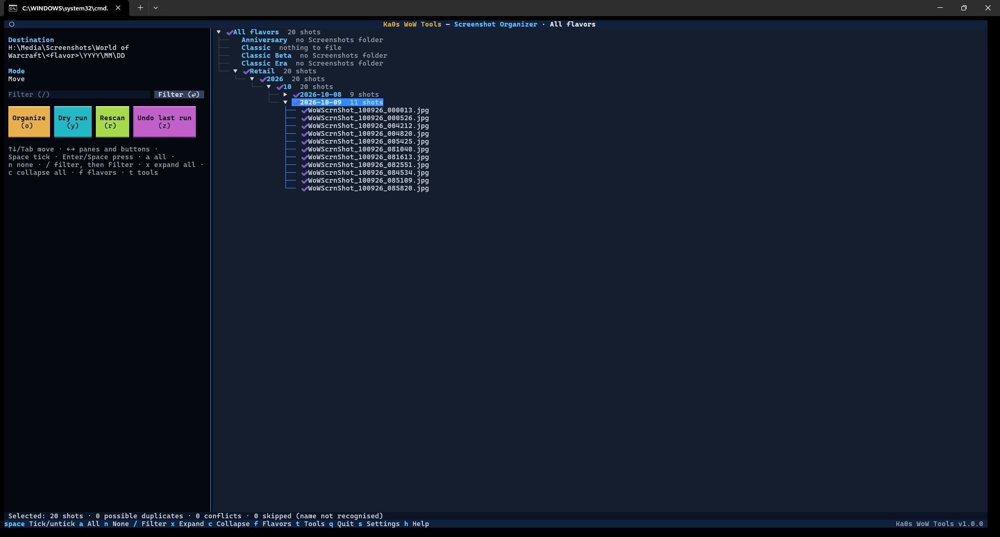
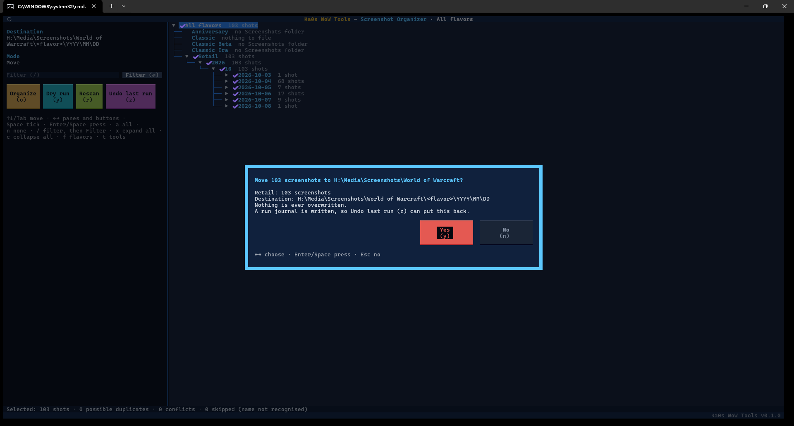
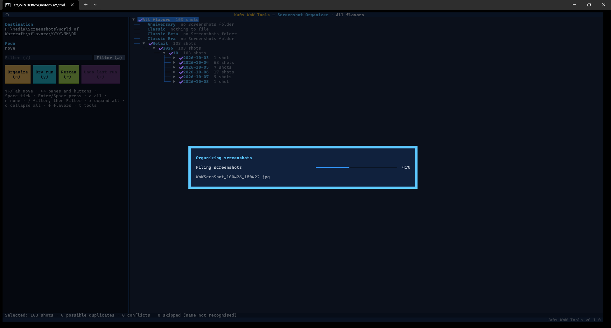
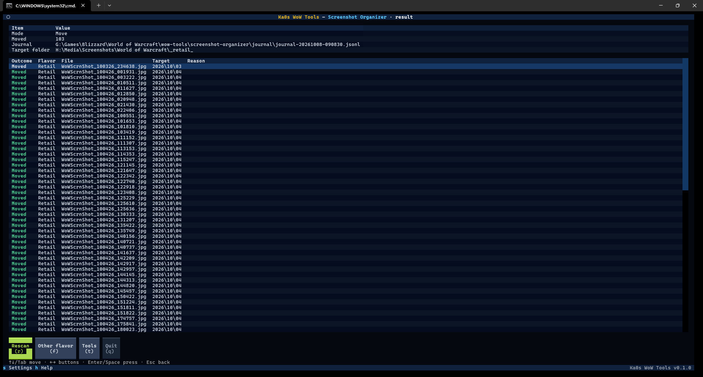

# Screenshot Organizer guide

[← Back to the main page](../README.md)

WoW saves every screenshot into one big folder per game version (`_retail_\Screenshots`,
`_classic_\Screenshots` and so on). Play for a few years and that folder holds thousands of files, and good luck
finding the one from your first Mythic kill.

The Screenshot Organizer sorts them into folders by **year, month and day**, one set per game version. It sorts
them right where they are, or moves them to a separate archive folder such as a photos drive. If you change your
mind, you can undo a run.

## Step by step

1. Start Ka0s WoW Tools and choose **Screenshot Organizer**.
2. **The first time only:** choose where screenshots should go (see [Where screenshots go](#where-screenshots-go))
   and press **Save**.
3. **Pick a game version**, or **All flavors**. Each row shows how many screenshots are waiting to be sorted.
   `t` or `Esc` goes back to the tool menu.
4. The organizer scans and opens the review screen. Untick any days you want to leave alone.
5. To see what would happen without moving anything, press **Dry run** (`y`).
6. Press **Organize** (`o`), read the summary, and press **Yes**.
7. The results screen lists every screenshot and where it went.

## Where screenshots go

You choose this with the **destination folder** setting:

| Destination folder | Screenshots end up in | Example |
|---|---|---|
| Empty (the default) | Dated folders inside the same `Screenshots` folder | `World of Warcraft\_retail_\Screenshots\2019\07\31\WoWScrnShot_073119_232713.jpg` |
| A folder you pick | `<that folder>\<game version folder>\<year>\<month>\<day>` | `H:\Media\Screenshots\World of Warcraft\_retail_\2019\07\31\WoWScrnShot_073119_232713.jpg` |

- File names are never changed.
- The date comes from the file name WoW gives each screenshot, `WoWScrnShot_MMDDYY_HHMMSS.jpg` (or .png / .tga, if
  you switched WoW to those; upper or lower case doesn't matter).
- The destination folder doesn't need to exist yet; it's created the first time.
- It can't be your WoW folder itself, or inside a game version's `Screenshots`, `WTF` or `Interface` folder.
- The organizer only adds dated folders and screenshots there. It never touches anything else in that folder,
  such as a photo program's own files.

## Picking a game version

The list shows every game version in your WoW folder, with **All flavors** at the top. Next to each one is the
number of screenshots waiting to be sorted. The counts take a moment to appear ("counting…"), but you don't have to
wait for them to pick.

Each count is a quick estimate based on file names. In move mode it includes possible duplicates and conflicts. In
copy mode it leaves out every screenshot whose name is already in its dated folder (copies you've made, and
conflicts). A version you've never taken a screenshot in says "no Screenshots folder", and so does one whose
`Screenshots` folder (or a dated folder in it) couldn't be read. The app remembers your choice for next time.

## The review screen

**_The Screenshot Organizer review screen_**

**On the right** is the list of screenshots waiting to be sorted:

game version → year → month → day → screenshots

Everything starts ticked, meaning "sort this". Untick a day, a month or a whole game version to leave it alone.
Open a day to see its screenshots. A game version with nothing to do says why: "no Screenshots folder" or
"nothing to file".

**On the left** are the buttons, where screenshots will go, and whether they'll be moved or copied.

**At the bottom** a bar totals what's ticked, plus possible duplicates, conflicts and skipped files (all
explained below).

**Unreadable folders**: when a game version's `Screenshots` folder couldn't be read, its screenshots can't be sorted and
its line in the tree says "could not be read (see Warnings)". A dated folder that couldn't be read is also listed as a
warning, but its screenshots are still offered for sorting (the scan treats that folder as empty). Either way a
**⚠ N unreadable folders (!)** button appears at the right end of the bottom bar. Click it or press `!` to open the
**warnings view**, which lists every warning by game version, each with the folder and what went wrong. The line on
the left shows the highlighted warning in full. `/` filters the list, `x` / `c` expand and collapse it, `h` opens the
help, **Back** (`Esc`) returns to the review, and `t` goes to the tool menu. With no warnings there's no button. The
warnings are in the log too.

**Filter**: `/` puts you in the filter box on the left. Type part of a name: a game version, a year, a date
such as `2024-01-02`, or a file name (upper or lower case doesn't matter), then press `Enter` or click the
**Filter** button beside the box (typing alone changes nothing). The tree keeps the matching lines and the groups
they're in, and opens a day when one of its screenshots matches. Apply an empty box to see everything again, or
press `Esc` in the box to clear the filter. The filter only changes what you see. `a` and `n` act on the lines it
shows, but a screenshot it hides keeps its tick and is still sorted; the bottom bar and the confirmation tell you how
many ("3 selected shots are hidden by the filter").

### Keys on the review screen

| Key | Does |
|---|---|
| `Space` | Tick or untick the highlighted line |
| `a` / `n` | Tick everything shown to sort / untick everything shown |
| `/` | Filter the tree: type part of a game version, a date (`2024-01`) or a file name; `Esc` in the box clears it |
| `o` | **Organize** the ticked screenshots (asks first; **Yes** is selected, in red) |
| `y` | **Dry run** (asks first; **Yes** is selected) |
| `x` / `c` | Expand every line of the tree / collapse them all |
| `!` | Open the unreadable folders (only while there are any; the **⚠ … (!)** button at the bottom does the same) |
| `r` | Scan again |
| `z` | **Undo last run** (asks first; **Yes** is selected, in red) |
| `f` or `Esc` | Pick another game version |
| `t` | Back to the tool menu |
| `s` | Settings |
| `h` | Help: this tool's keys and steps, with a link to this guide |
| `q` | Quit |
| `←` `→` | Jump between the list and the left panel |
| `Tab` | Move to the next control |

If you change the settings, press `r` to scan again with them.

## Organizing

When you press **Organize**, the organizer asks you to confirm and shows how many screenshots go where:

**_Confirming a run_**

Once you confirm, a progress window shows the file being handled:

**_Organizing in progress_**

Then the results screen shows a summary and every screenshot with what happened to it and where it went:

**_The results of a run_**

From here, `r` (**Rescan**) scans again, `f` (**Other flavor**) picks another game version, `t` (**Tools**) goes
back to the tool menu, and `q` (**Quit**) quits. `Esc` goes back to the review (and scans again).

### Dry run

A **Dry run** goes through all the same checks and shows you what *would* happen ("Would move", "Would copy",
"Would remove duplicate"). It doesn't create a folder or move a single file. If you're unsure, do a dry run first.

### Moving to another drive

If the destination is on a different drive, each screenshot is copied and the copy is checked. Only then is the
original deleted. The file keeps its date and time, so photo programs still sort it correctly.

## Duplicates and conflicts

Sometimes a screenshot with the same name is already in its dated folder, for example from an earlier run.

- **The same file** (identical contents): it's already sorted, so the copy left in `Screenshots` is removed. The
  results say "Duplicate removed". In copy mode it's left alone ("Already filed").
- **A different file with the same name**: that's a **conflict**. Both files are left exactly as they are, and the
  review screen lists them under "Conflicts" so you can sort them out yourself.

**Nothing is ever overwritten.**

## Files that aren't sorted

Only files with WoW's screenshot name (`WoWScrnShot_` followed by a date and time) are sorted. Anything else in
the `Screenshots` folder, such as a renamed picture or a note, stays where it is and is listed under "Skipped:
name not recognised".

## Copy mode

Turn on **Copy instead of move** in settings to copy screenshots into the dated folders and keep the originals in
`Screenshots` too. Every copy is checked before it counts.

On the next scan, originals you've already copied are no longer "waiting". If a file with the same name and size is
already in its dated folder, the review screen lists it unticked under "Already filed" for that game version, and the
game version list doesn't count it. You can still tick it by hand (`a` skips these). The run then compares the two
files and reports "Already filed" or "Conflict (kept both)".

## Undo last run

Changed your mind? **Undo last run** (`z`, the violet button) reverses the most recent run:

- Moved screenshots go back to their `Screenshots` folder.
- Copies are removed (only if the original is still there). A copy you already deleted yourself counts as
  undone.
- Duplicates that were removed are put back.

A few rules keep undo safe:

- It only touches screenshots that haven't changed since the run, and only where that run filed them. Anything
  else is left alone and listed.
- Dated folders that end up empty are removed; no other folders are.
- Undo only goes back **one run**. After you undo, the button stays greyed out until your next run.
- If nothing could be put back because the filed screenshots are missing (for example the archive drive isn't
  connected), the undo doesn't count: connect the drive and press **Undo last run** again.
- A screenshot that's already back in its `Screenshots` folder (say an earlier undo was cut short, or you moved
  it back yourself) is left alone and listed as already back.

Each run's record (its **journal**) is kept in `<your WoW folder>\wow-tools\screenshot-organizer\journal`, never
in your screenshot archive. The newest 10 are kept (a shared setting, see below).

## Settings

Press `s` in the organizer (you get the shared settings first, then the organizer's). The organizer's settings are
saved in `config\screenshot-organizer.cfg`.

| Setting | Starts as | What it means |
|---|---|---|
| Destination folder | empty | Where screenshots go. Empty means sort them in place |
| Copy instead of move | off | Keep the originals in `Screenshots` as well |

The file itself uses these names, if you edit it by hand: `dest_dir`, `copy_mode` and `last_flavor_choice`. Close the
app before editing the file, or your change may be overwritten. Comments you add to the file aren't kept (the app
rewrites it when it saves a setting or the game version you pick).

Three settings are shared by every tool: how many backups and journals to keep, and how many game versions to
work on at once. They're on the first screen `s` opens (the one with your WoW folder) and are saved under
`[general]` in `config\wow-tools.cfg` as `keep_backups` (10; `0` keeps all), `keep_journals` (10) and `parallelism`
(2, from 1 to 8; use 1 on a hard drive or a WSL `/mnt` folder). The game version list counts the waiting screenshots
in up to `parallelism` game versions at once. Filing them is still one run with one journal.

## FAQ

| Question | Answer |
|----------|--------|
| Do I need to close WoW first? | No. Sorting screenshots doesn't depend on the game. Just don't expect a screenshot you take mid-run to be in that run; press `r` to scan again. |
| Will it rename my screenshots? | No. File names are never changed. |
| Where does it get the date from? | From the name WoW gives every screenshot, `WoWScrnShot_MMDDYY_HHMMSS.jpg`, so the date is the day you took it, even if the file was copied later. |
| Can I keep the originals where they are? | Yes. Turn on **Copy instead of move** in settings. |
| Is it safe to point it at my photos drive? | Yes. In the destination folder it only creates year, month and day folders and adds screenshots. It never touches anything else there, such as a photo program's database. |
| Does it handle Classic, PTR and Beta screenshots? | Yes, every game version in your WoW folder, each into its own set of folders. |
| Can I undo a run from last week? | **Undo last run** only goes back to the most recent run. |

## Troubleshooting

| Symptom | Fix |
|---------|-----|
| "No Screenshots folders found" | You haven't taken a screenshot in any game version yet. Take one in game first (the Print Screen key). |
| A screenshot stays in `Screenshots` after organizing | Its name isn't a WoW screenshot name, or a different file with the same name is already sorted (a conflict). Both are listed on the review and results screens. |
| The destination is refused | It must be a full path (such as `D:\Screenshots`), and it can't be your WoW folder itself or inside a game version's `Screenshots`, `WTF` or `Interface` folder. To sort in place, leave it empty. The organizer checks this when you save the settings and again before each scan, in case the file was edited by hand. |
| **Undo last run** is greyed out | There's nothing to undo: you haven't run it yet, or you already undid the last run. |
| Moving to another drive is slow | Each screenshot is copied and checked before the original is removed, so a big first run takes a while. Later runs only handle new screenshots. From WSL it's slower still; see the main [Troubleshooting](../README.md#troubleshooting). |
| Something else looks wrong | Follow [Reporting a bug](../README.md#reporting-a-bug) in the main README. |
