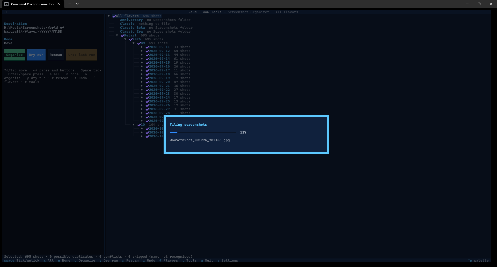
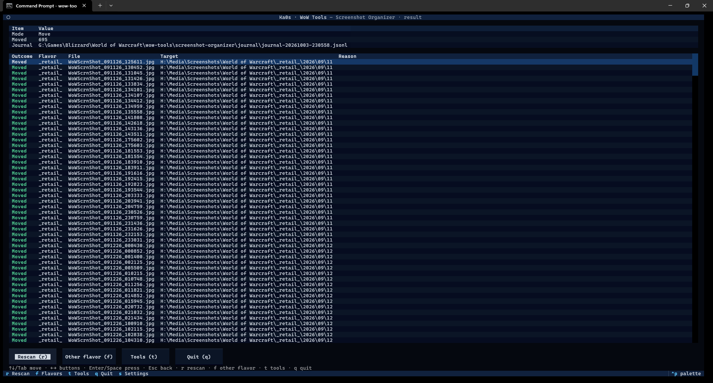

# Screenshot Organizer guide

[← Back to the main page](../README.md)

WoW saves every screenshot into one big folder per game version (`_retail_\Screenshots`,
`_classic_\Screenshots` and so on). Play for a few years and that folder holds thousands of files, and good luck
finding the one from your first Mythic kill.

The Screenshot Organizer sorts them into folders by **year, month and day**, one set per game version. It can
sort them right where they are, or move them into a separate archive folder, such as a photos drive. You can undo
a run afterwards.

## Step by step

1. Start Ka0s WoW Tools and choose **Screenshot Organizer**.
2. **The first time only:** choose where screenshots should go (see [Where screenshots go](#where-screenshots-go))
   and press **Save**.
3. **Pick a game version**, or **All flavors**. Each row shows how many screenshots are waiting to be sorted.
4. The organizer scans and shows you the review screen. Untick any days you want to leave alone.
5. Press **Dry run** (`y`) if you'd like to see what would happen without moving anything.
6. Press **Organize** (`o`), read the summary, and press **Yes**.
7. The results screen lists every screenshot and where it went.

## Where screenshots go

You choose this with the **destination folder** setting:

| Destination folder | Screenshots end up in | Example |
|---|---|---|
| Empty (the default) | Dated folders inside the same `Screenshots` folder | `World of Warcraft\_retail_\Screenshots\2019\07\31\WoWScrnShot_073119_232713.jpg` |
| A folder you pick | `<that folder>\<game version folder>\<year>\<month>\<day>` | `H:\Media\Screenshots\World of Warcraft\_retail_\2019\07\31\WoWScrnShot_073119_232713.jpg` |

- File names are never changed.
- The date comes from the file name WoW gives each screenshot, `WoWScrnShot_MMDDYY_HHMMSS.jpg`.
- The destination folder doesn't need to exist yet; it's created the first time.
- The organizer only adds dated folders and screenshots there. It never touches anything else in that folder,
  such as a photo program's own files.

## Picking a game version

The list shows every game version in your WoW folder, with **All flavors** at the top. Next to each one you see
how many screenshots are waiting to be sorted. A version you've never taken a screenshot in says "no Screenshots
folder". Your choice is remembered for next time.

## The review screen

**On the right** is the list of screenshots waiting to be sorted:

game version → year → month → day → screenshots

Everything starts ticked, meaning "sort this". Untick a day, a month or a whole game version to leave it alone.
Open a day to see its screenshots. A game version with nothing to do says why: "no Screenshots folder" or
"nothing to file".

**On the left** you see where screenshots will go, whether they'll be moved or copied, and the buttons.

**At the bottom** a bar totals what's ticked, plus possible duplicates, conflicts and skipped files (all
explained below).

### Keys on the review screen

| Key | Does |
|---|---|
| `Space` | Tick or untick the highlighted line |
| `a` / `n` | Tick everything / untick everything |
| `o` | **Organize** the ticked screenshots (asks first; the answer starts on **No**) |
| `y` | **Dry run** (asks first; the answer starts on **Yes**) |
| `r` | Scan again |
| `z` | **Undo last run** (asks first; the answer starts on **No**) |
| `f` | Pick another game version |
| `t` | Back to the tool menu |
| `s` | Settings |
| `q` | Quit |
| `←` `→` | Jump between the list and the left panel |

If you change the settings, press `r` to scan again with them.

## Organizing

When you press **Organize** and confirm, a progress window shows the file it's working on:

Then the results screen shows a summary and every screenshot with what happened to it and where it went:

From here, `r` scans again, `f` picks another game version, `t` goes back to the tool menu, and `q` quits.

### Dry run

A **Dry run** goes through all the same checks and shows you what *would* happen ("Would move", "Would copy",
"Would remove duplicate"), without creating a folder or moving a single file. When in doubt, do a dry run first.

### Moving to another drive

If the destination is on a different drive, each screenshot is copied first and checked, and only deleted from
its old place once the copy is confirmed good. The file's date and time are kept, so photo programs still sort it
correctly.

## Duplicates and conflicts

Sometimes a screenshot with the same name is already in its dated folder, for example from an earlier run.

- **The same file** (identical contents): it's already sorted, so the copy left in `Screenshots` is removed. The
  results say "Duplicate removed". In copy mode it's simply left alone ("Already filed").
- **A different file with the same name**: that's a **conflict**. Both files are left exactly as they are, and the
  review screen lists them under "Conflicts" so you can sort them out yourself.

**Nothing is ever overwritten.**

## Files that aren't sorted

Only files with WoW's screenshot name (`WoWScrnShot_` followed by a date and time) are sorted. Anything else in
the `Screenshots` folder, such as a renamed picture or a note, stays where it is and is listed under "Skipped:
name not recognised".

## Copy mode

Turn on **Copy instead of move** in settings to copy screenshots into the dated folders and keep the originals in
`Screenshots` too. Every copy is checked before it counts.

## Undo last run

Changed your mind? **Undo last run** (`z`, the amber button) reverses the most recent run:

- Moved screenshots go back to their `Screenshots` folder.
- Copies are removed (only if the original is still there).
- Duplicates that were removed are put back.

Undo is careful too:

- It only touches screenshots that haven't changed since the run. Anything else is left alone and listed.
- Dated folders that end up empty are removed; no other folders are.
- Undo only goes back **one run**. After you undo, the button stays greyed out until your next run.

Each run's record (its **journal**) is kept in `<your WoW folder>\wow-tools\screenshot-organizer\journal`, never
in your screenshot archive. The newest 10 are kept.

## Settings

Press `s` in the organizer. The settings are saved in `config\screenshot-organizer.cfg`.

| Setting | Starts as | What it means |
|---|---|---|
| Destination folder | empty | Where screenshots go. Empty means sort them in place |
| Copy instead of move | off | Keep the originals in `Screenshots` as well |
| Journals to keep | 10 | How many run records to keep for Undo |

The file itself uses these names, if you edit it by hand: `dest_dir`, `copy_mode`, `keep_journals` and
`last_flavor_choice`.

> Older versions called this tool `screenshots`. The app renames its old settings file, log folder and
> `wow-tools\screenshots` folder to the new `screenshot-organizer` names automatically, and never overwrites
> anything while doing so.

## Troubleshooting

- **"No Screenshots folders found".** You haven't taken a screenshot in any game version yet. Take one in game
  first (the Print Screen key).
- **A screenshot stays in `Screenshots` after organizing.** Its name isn't a WoW screenshot name, or a different
  file with the same name is already sorted (a conflict). Both are listed on the review and results screens.
- **The destination is refused in settings.** It can't be your WoW folder itself or inside a `Screenshots`
  folder. To sort in place, leave it empty.
- **Undo last run is greyed out.** There's nothing to undo: you haven't run it yet, or you already undid the last
  run.
