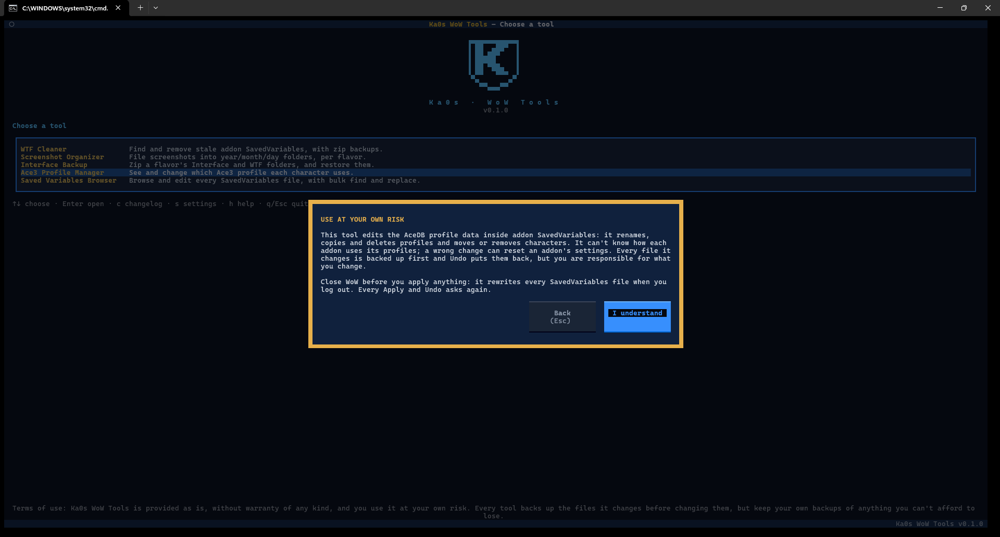
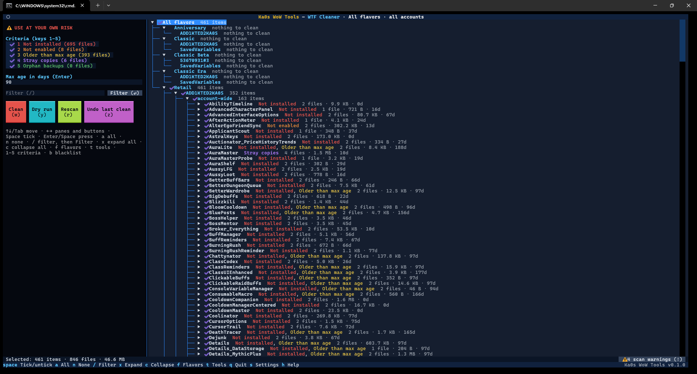
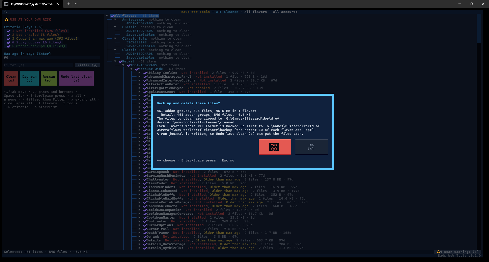
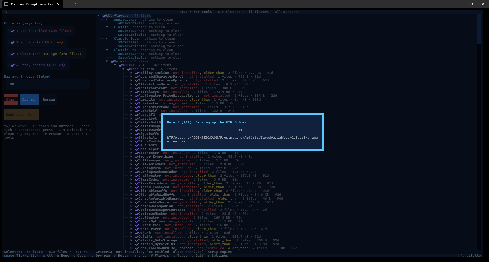
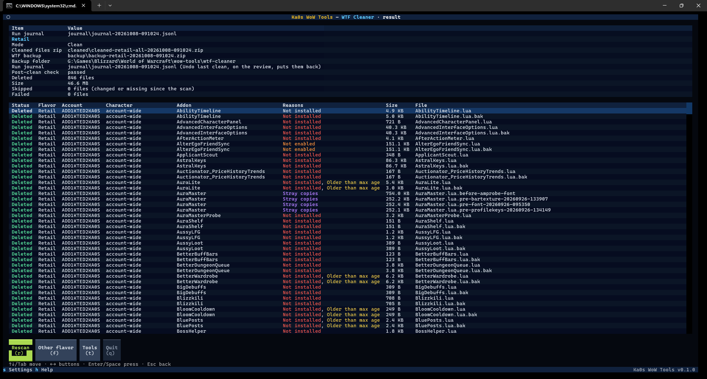

# WTF Cleaner guide

[← Back to the main page](../README.md)

Every addon you install saves its settings in WoW's `WTF` folder, in files called **SavedVariables**. When you
remove an addon, its files stay behind, and after a few years of trying addons out you can easily have hundreds
of them.

The WTF Cleaner finds those leftovers and shows you the list. It backs up the files first and deletes only the
ones you leave ticked. If you regret it later, you can undo the clean.

> **Close WoW before you clean.** WoW rewrites these files when you log out, and it can bring back files you
> just removed. The cleaner warns you if WoW is running.

## Step by step

1. Start Ka0s WoW Tools and choose **WTF Cleaner**.
2. **The first time only:** check the settings (see [Settings](#settings)) and press **Save**. The suggested
   values are fine for most people.
3. **Pick a game version**, or **All flavors** to clean every version at once. `t` or `Esc` goes back to the tool menu.
4. If you picked one version that has more than one WoW account, **pick an account**, or **All accounts**.
   `Esc` goes back to the game versions, `t` to the tool menu.
5. Read the **USE AT YOUR OWN RISK** warning: the cleaner deletes files, so it asks you to accept that first.
   **I understand** goes on; **Back** returns to the game versions. It's asked once each time you start the app,
   not every time you open the tool. See [The USE AT YOUR OWN RISK warning](#the-use-at-your-own-risk-warning).
6. The cleaner scans and shows you the review screen. Look through the list and untick anything you want to
   keep.
7. Press **Dry run** (`y`) if you'd like to see what would happen without deleting anything.
8. Press **Clean** (`w`), read the summary, and press **Yes**.
9. The results screen lists every file and what happened to it.

`t` goes back to the tool menu from any screen or popup (not while a clean is running), and `q` quits.

## The USE AT YOUR OWN RISK warning

**_The USE AT YOUR OWN RISK warning_**



The cleaner deletes addon settings files by the rules you tick, and it can't know what an addon still needs: a
deleted file takes that addon's settings with it. So before the first scan it shows this warning. In the
cleaner's wording: a backup zip of your `WTF` folder is made first and **Undo last clean** puts the files back, but
you're responsible for what you clean; close WoW before you clean; every **Clean** and **Undo** asks again.

- It comes after you pick a game version and, when that version has more than one account, an account, just
  before the first scan. The popup opens over the tool menu.
- **I understand** goes on. It's remembered until you close the app, so the warning is asked once each time you
  start it, not every time you open the tool.
- **Back** (or `Esc`) goes back to the game versions (not the account list). It doesn't count: the warning is
  asked again next time. `t` closes the tool without answering, so it's asked again too.
- Tick **Don't show this warning again for this tool** (`Tab` to it, `Space` to tick; `Enter` on the box presses
  **I understand**) before **I understand** to stop it for good. **Show the USE AT YOUR OWN RISK warning** in the
  cleaner's [settings](#settings) turns it back on.
- Whatever you choose, the red `⚠ USE AT YOUR OWN RISK` line stays on the review's left panel.

## The review screen

**_The WTF Cleaner review screen_**



**On the right** is the list of files the cleaner suggests removing, grouped like this:

game version → account → account-wide settings or one character → addon → files

Everything starts ticked, meaning "remove this". Untick an addon, a character or a whole account to keep it.
An account or game version with nothing to remove says "nothing to clean".

**On the left** are a red `⚠ USE AT YOUR OWN RISK` line (a clean deletes files), the rules that decide what gets
suggested (under **Criteria (keys 1-5)**), the age limit (**Max age in days**), and the buttons.

**At the bottom** a bar totals what's ticked (items, files and size) and names any game version that couldn't be
scanned. When the scan couldn't read something, a **⚠ N scan warnings (!)** button sits at the right end of the bar:
see [Scan warnings](#scan-warnings).

### The five rules

The left panel lists the rules under **Criteria (keys 1-5)**. A file is suggested if **any** ticked rule matches
it. All five are on to start with, and each has its own
colour, used in the list too:

| Rule | Suggests | Example |
|---|---|---|
| **1 Not installed** (red) | Settings for addons that are no longer installed | `OldBagAddon.lua` after you removed that addon |
| **2 Not enabled** (orange) | Settings for addons that are installed but switched off on every character of that account | An addon you disabled everywhere, or that only your other account uses |
| **3 Older than max age** (yellow) | Addons whose settings haven't changed in a long time (90 days to start with) | An addon from last expansion that you stopped using |
| **4 Stray copies** (purple) | Copies you or another program made by hand next to the real file | `Details.lua - Copy.bak` |
| **5 Orphan backups** (green) | A backup WoW made (`<Addon>.lua.bak`) whose settings file (`<Addon>.lua`) is gone | `Auctionator.lua.bak` with no `Auctionator.lua` |

When an addon matches rule 1, 2 or 3, all of its files go: `Auctionator.lua`, `Auctionator.lua.bak` and any stray
copies. Rules 4 and 5 suggest only the extra files of an addon that is otherwise kept.

Each rule shows how many files it matches, for example `1 Not installed (672 files)`. Press `1` to `5`
to switch a rule on or off. To change the age limit, type a number of days in the **Max age** box and press
Enter.

### What the cleaner never touches

- Addons on your [blacklist](#the-blacklist).
- Blizzard's own settings (any file starting with `Blizzard_`).
- Everything that isn't addon settings: your keybindings, macros, chat setup, UI layout, and the list of enabled
  addons.
- Anything outside the `WTF` folder of the game version you picked.

If a game version has no addons installed at all, the cleaner refuses to scan it, so it can't suggest deleting
everything by mistake. With All flavors, that version shows "not scanned: no addons installed" (the log has the
folder it looked in) and the others carry on.

### Accounts

- **All accounts** (the usual choice): every account's files are scanned, each judged on its own (see below).
- **One account**: only that account's files are scanned. The verdict is the same as with All accounts.
- **All flavors**: every game version is scanned (up to `parallelism` at once, see Settings), each with all its
  accounts.

"Not enabled" is decided per account: an addon counts as enabled for an account's files (its account-wide
settings and every one of its characters' settings) if *any* character of *that* account has it switched on. An
addon you only use on your main account does not keep your second account's settings for it: those are
suggested. Within one account a character's own settings are kept while
any character of the account uses the addon, so switching an addon off on one alt never suggests that alt's file.

A character that has never changed its addon list counts as having every addon enabled, because that's what WoW
does.

If an account has no characters at all (only account-wide settings), the cleaner can't tell what is switched off
there, so it counts every installed addon as enabled for that account and the "Not enabled" rule suggests nothing
in it. The scan notes this in its [warnings](#scan-warnings).

### The blacklist

Some addons you never want cleaned, whatever the rules say (an addon you only load now and then, say). Put them on
the blacklist: highlight the addon's line in the tree, or one of its files, and press `b`. A short note
confirms it ("ElkBuffBars (Retail) is now on the blacklist.").

- A blacklisted addon stays in the tree, greyed out and tagged **blacklisted**, so you can still see what the rules
  would suggest. Its lines show `⊘` where the tick goes, its files too. It has no tick: `Space`, `a` and `n` skip
  it, and it's left out of the rule counts, the bottom bar, the confirmation, **Clean** and **Dry run**.
- An addon is blacklisted in one game version: blacklisting ElkBuffBars in Retail leaves ElkBuffBars in Classic
  Era to the rules. With **All flavors**, `b` works on the game version of the line you're on.
- `b` on a blacklisted addon takes it off again. Either way it's saved at once.
- `b` on a line that isn't one addon (a game version, an account, a character) only tells you to highlight an
  addon first.
- A blacklisted addon that no rule matches isn't in the tree at all (there's nothing to clean). To take it off,
  edit the list by hand (below).

The list is `blacklist` under `[wtf_cleaner]` in `config\wtf-cleaner.cfg`: game version folder and addon name
pairs, separated by commas, for example

```ini
blacklist = _retail_:ElkBuffBars, _classic_era_:Questie, WeakAuras
```

Upper or lower case doesn't matter. A name with no game version (`WeakAuras` above, or `*:WeakAuras`) is
blacklisted in every game version; `b` on it in one game version takes it off there only and keeps it in the
others. Close the app before editing the file, or your change may be overwritten. Comments you add to the file
aren't kept (the app rewrites it when it saves a setting). The settings screen doesn't show the list, but saving it
keeps it.

### Keys on the review screen

| Key | Does |
|---|---|
| `Space` | Tick or untick the highlighted line |
| `a` / `n` | Tick / untick every file shown (a file a rule or the filter hides keeps its tick; blacklisted files are skipped) |
| `b` | Put the highlighted addon (or the addon of the highlighted file) on the [blacklist](#the-blacklist), or take it off |
| `!` | Open the [scan warnings](#scan-warnings) (only while there are any; the **⚠ … (!)** button at the bottom does the same) |
| `/` | Filter the tree (see below) |
| `1` to `5` | Switch a rule on or off |
| `w` | **Clean** the ticked files (asks first; **Yes** is selected, in red) |
| `y` | **Dry run** (asks first; **Yes** is selected) |
| `x` / `c` | Expand every line of the tree / collapse them all |
| `r` | Scan again |
| `z` | **Undo last clean** (asks first; **Yes** is selected, in red) |
| `f` or `Esc` | Pick another game version |
| `t` | Back to the tool menu (from any screen or popup; not while a clean is running) |
| `s` | Settings |
| `h` | Help: this tool's keys and steps, with a link to this guide |
| `q` | Quit |
| `←` `→` | Jump between the list and the left panel |
| `Tab` | Move to the next control |

### Filtering the tree

`/` puts you in the filter box on the left. Type part of a name: an account, a character, an addon or a file (upper or
lower case doesn't matter), then press `Enter` or click the **Filter** button beside the box (typing alone changes
nothing, so a big tree isn't rebuilt on every key). The tree keeps the matching lines and the groups they're in, and
opens an addon when one of its files matches; a matching account or addon keeps everything in it. The filter works on
top of the rules. A game version that wasn't scanned stays only while its name matches, and a filter that matches
nothing says so in the tree. An empty box, applied, shows everything again; `Esc` in the box clears the filter and goes
back to the tree.

The filter only changes what you see. `a` and `n` tick and untick what it shows; a file it hides keeps its tick and
is still cleaned. When that's the case, the bottom bar and the confirmation say so ("12 selected files are hidden
by the filter").

### Scan warnings

When the scan couldn't read something (a folder, a settings file, a line of an `AddOns.txt`) it carries on without
it and counts it. The count shows as a button at the right end of the bottom bar, **⚠ 4 scan warnings (!)**: click
it or press `!` to open the **warnings view**. It lists every warning, grouped by game version, each with where it
is (the path inside that game version's folder) and what went wrong; the line on the left shows the highlighted one
in full. `/` filters the list, `x` / `c` expand and collapse it, `h` opens the help, **Back** (`Esc`) returns
to the review, and `t` goes to the tool menu. With no warnings, there's no button. The log still has them too.

## Cleaning

When you press **Clean**, the bottom bar says "Checking for running programs…" for a moment while the cleaner
looks for WoW and for programs that lock these files. Your ticks and filters can't be changed during that moment,
so what you confirm is exactly what the list shows. Then it asks you to confirm:

**_Confirming a clean_**



Once you do, a progress window shows each step and the file it's working on:

**_A clean in progress_**



Before anything is deleted, the cleaner:

1. **Starts a journal**, a short record used by **Undo last clean**. If it can't write the journal, nothing is
   deleted.
2. **Checks that no other program has the files open.** The Raider.IO client and the WeakAuras Companion are
   known to lock these files. If any file is locked, the clean stops with nothing deleted and tells you which
   ones. Close that program and try again. (It checks by renaming each file to `<name>.wowtools-lockcheck` and
   straight back. If the app is closed in that split second, the next clean puts the file back first, and the
   scan warns about it until then.)
3. **Backs up your whole `WTF` folder** into a zip file and checks the zip. If the backup fails, nothing is
   deleted.
4. **Zips the files it's about to remove** and checks that zip too. If it fails, nothing is deleted.

Then it deletes the files, and finally it compares your `WTF` folder against the backup to make sure only the
right files are gone.

With **All flavors**, the game versions are cleaned one after another, and each gets the lock check, the backup
and the zip steps; one journal covers the whole run. If one version runs into a problem, the cleaner stops there,
and the versions after it aren't touched.

### The results screen

**_The results of a clean_**



The top table sums up the clean: how many files were deleted, where the zips are, whether the final check
passed, and the run journal (what **Undo last clean** uses). With All flavors there's a block for each game
version, and the run journal is named once, at the top. The table below lists every file with what
happened to it, its account, character, addon, size and why it was suggested.

From here, `r` (**Rescan**) scans again, `f` (**Other flavor**) picks another game version, `t` (**Tools**) goes
back to the tool menu, and `q` (**Quit**) quits. `Esc`, like `r`, goes back to the review and scans again.

### Dry run

A **Dry run** checks that WoW is running (and warns you), checks the files again and, unless
**Zip the files to clean before deleting them** is turned off in settings, writes the zip of the files it *would* remove
(named `dryrun-…zip`, so you can tell it from a real clean's zip). It takes no WTF backup, does no lock check, writes no
journal and deletes nothing. It shows you the same results screen. When in doubt, do a dry run first. Since dry runs
tend to be repeated, only the newest few dry-run zips of each game version are kept (the same number as WTF backups, 10
unless you change it).

## Undo last clean

Changed your mind? **Undo last clean** (`z`, the violet button) puts back every file the most recent clean
deleted. It asks first and tells you when that clean ran and how many files it removed.

- Files come back from the zip the cleaner made before deleting, or from the backup of your whole `WTF` folder.
- If a file with the same name has appeared since (WoW may have written a new one), it's **left alone**. Undo never
  overwrites anything.
- Undo only goes back **one clean**. After you undo, the button stays greyed out until your next clean.

Close WoW before you undo.

## Where your backups go

The cleaner saves its zips in its backup folder. Unless you change it in settings, that's
`<your WoW folder>\wow-tools\wtf-cleaner`. The journals always go to
`<your WoW folder>\wow-tools\wtf-cleaner\journal`, even if you pick another backup folder:

```
wow-tools\wtf-cleaner\
  backup\backup-<flavor>-<YYYYMMDD-HHMMSS>.zip                 your whole WTF folder, taken before each clean
  cleaned\cleaned-<flavor>-<account>-<YYYYMMDD-HHMMSS>.zip     just the files that clean removed
  cleaned\dryrun-<flavor>-<account>-<YYYYMMDD-HHMMSS>.zip      the files a dry run would have removed
  journal\journal-<YYYYMMDD-HHMMSS>.jsonl                      the record Undo last clean uses
```

`<flavor>` is the game version (`retail`, `classic_era` and so on) and `<account>` is the account you picked, or
`all`. For example: `cleaned-retail-all-20261003-140311.zip`. If two cleans start in the same second, the second
gets `-2` added before `.zip`, so no backup ever replaces another.

- The **cleaned** zips are all kept, unless you set **Cleaned-files zips to keep** in the cleaner's settings (see
  [Settings](#settings)). Then, after each clean that deleted something, only the newest that many of the game
  version are kept (any account, counting the one that clean just made). A dry run never removes them.
- After each clean that deleted something, only the newest 10 **backups** of each game version are kept (you can
  change this in the shared settings, the first screen `s` opens; `0` keeps them all).
- Only the newest 10 **dry-run** zips of each game version are kept (the same setting). Dry-run zips made by older
  versions of the app are named `cleaned-…` like real ones, so they're kept unless you set
  **Cleaned-files zips to keep**, which counts and removes them like real cleaned zips.
- Only the newest 10 **journals** are kept (also a shared setting).

## Restoring a backup

**Undo last clean** is the easy way. To restore by hand instead (for example an older clean):

- **Some files from a clean:** close WoW, open the `cleaned\cleaned-…zip`, and extract it
  **into the game version's folder** (for example `World of Warcraft\_retail_`), keeping the folders. The files land
  back where they were. You can ignore `manifest.json`.
- **The whole WTF folder:** the same, with a `backup\backup-…zip`. This puts back the whole folder exactly as it
  was before that clean, so only do it if something is really missing.

## If a clean was interrupted

If the app is closed in the middle of a clean (a power cut, or you closed the window), it notices next time. It
**never restores on its own**. Instead it shows a message saying when that clean started and where its backup is:

- **Dismiss (keep the backup)** clears the message and keeps the backup.
- **Remind me next time** shows it again next time.

Until you dismiss it, new cleans are refused (dry runs still work), so the cleaner can't lose track of that
backup.

Sometimes another program (a virus scanner or OneDrive) holds the cleaner's marker file
(`clean-in-progress.json` in the backup folder) for a moment, so it can't be removed:

- **After a clean that finished**, the result shows a **Crash marker** row saying so. That clean is complete, so
  when the next start says an earlier clean did not finish, nothing is missing: just dismiss it.
- **When you dismiss the message**, a "Marker not removed" notice says so. New cleans stay refused until the file
  is gone: dismiss the message again next time, or delete the file yourself.

## Settings

Press `s` in the cleaner (you get the shared settings first, then the cleaner's). The cleaner's settings are saved
in `config\wtf-cleaner.cfg`.

| Setting | Starts as | What it means |
|---|---|---|
| Propose SavedVariables older than this many days | 90 | The age limit for rule 3 (**Max age in days** on the review) |
| Backup folder | empty | Where zips and backups go. Empty means `<WoW folder>\wow-tools\wtf-cleaner`. It must be a full path, and it can't be your WoW folder itself or inside a game version's `WTF`, `Interface` or `Screenshots` folder |
| Propose SavedVariables when: (the five rules) | all on | Which rules are on when the review screen opens. Each box has the rule's long name: **Addon is not installed**, **Addon is installed but not enabled on any character of its account**, **SavedVariables are older than the age limit**, **Hand-made copies** and **`<Addon>.lua.bak` with no `<Addon>.lua` next to it** |
| Zip the files to clean before deleting them (recommended) | on | Keep a zip of everything a clean removes |
| Cleaned-files zips to keep | 0 | How many `cleaned\cleaned-…zip` files to keep per game version; `0` keeps them all. Older ones are removed after a clean. The zip of the last clean is always kept, so **Undo last clean** is unaffected. A removed zip of an older clean can only be restored by hand from its WTF backup (`backup\backup-…zip`) while that is still kept |
| Show the USE AT YOUR OWN RISK warning | on | Ask you to accept the warning after you pick a game version (and account) (once each time you start the app). Off when you ticked **Don't show this warning again for this tool** on it |

The file itself uses these names, if you edit it by hand: `max_age_days`, `criterion_not_installed`,
`criterion_not_enabled`, `criterion_older_than`, `criterion_stray_copies`, `criterion_orphan_backups`,
`backup_before_delete`, `keep_cleaned`, `backup_dir`, `blacklist` (see [The blacklist](#the-blacklist); it has no row
on the settings screen, `b` on the review edits it), `skip_risk_warning` (`true` means the warning isn't shown),
`last_account` and `last_flavor_choice`. Close the app before
editing the file, or your change may be overwritten. Comments you add to the file aren't kept (the app rewrites it
when it saves a setting or the game version you pick).

Backups and journals to keep, and game versions to work on at once, are shared by every tool: they're on the first
screen `s` opens (the one with your WoW folder), and saved as `keep_backups` (10; `0` keeps all), `keep_journals` (10)
and `parallelism` (2, from 1 to 8; use 1 on a hard drive or a WSL `/mnt` folder) under `[general]` in
`config\wow-tools.cfg`. With **All flavors**, the scan reads up to `parallelism` game versions at once. A clean (and a
dry run) still does one game version after another: they share one safety marker, and the clean stops at the first game
version that fails. The WTF backups and the dry-run zips both follow `keep_backups`. The cleaned-files zips are the one
exception: they follow the cleaner's own `keep_cleaned`.

## FAQ

| Question | Answer |
|----------|--------|
| What is a SavedVariables file? | The file an addon keeps its settings in, such as `Details.lua`. WoW writes them to the `WTF` folder when you log out. They're safe to delete for addons you no longer use; the addon simply starts with default settings if you ever install it again. |
| Will it delete settings for addons I still use? | Not with the usual rules. Rule 1 only suggests addons that aren't installed, and rule 2 only addons switched off on every character of that account. Rule 3 (older than the age limit) can catch an addon you still have but rarely load, so look through the list and untick anything you want to keep. |
| Does it check whether WoW is running? | Yes, before every clean, for the game versions you're cleaning, and it warns you if WoW is open. This works on Windows, WSL, Mac and Linux. |
| Does it touch my keybindings, macros or UI layout? | No. It only ever looks at addon settings files. Blizzard's own settings, keybindings, macros, chat setup, UI layout and your list of enabled addons are never touched. |
| What's the difference between a Dry run and Clean? | A **Dry run** checks the files and, unless zipping is off, writes the zip of what it would remove; it takes no WTF backup, writes no journal and deletes nothing, so you can see the full results first. **Clean** deletes the ticked files after backing them up. |
| Can I clean one account only? | Yes. Pick a single game version; if it has more than one account, the next screen lets you pick one. |
| How much space do the backups take? | Each WTF backup is a zip of your whole `WTF` folder, so it depends on how big that folder is (zipping shrinks these text files a lot). Only the newest 10 per game version are kept (you can change that in the shared settings; `0` keeps them all), and the same number of dry-run zips. The zips of cleaned files are kept until you delete them, unless you set **Cleaned-files zips to keep** in the cleaner's settings. |
| How do I stop it suggesting an addon I still want? | Highlight the addon in the review and press `b`: it goes on the [blacklist](#the-blacklist) for that game version and is never ticked or cleaned again until you press `b` on it once more. |
| What are the scan warnings? | Things the scan couldn't read, so it left them out. Click **⚠ N scan warnings (!)** at the bottom, or press `!`, to see each one and where it is. See [Scan warnings](#scan-warnings). |
| Can I undo a clean from last week? | **Undo last clean** only goes back to the most recent clean. For an older one, unzip its files by hand; see [Restoring a backup](#restoring-a-backup). |

## Troubleshooting

| Symptom | Fix |
|---------|-----|
| Files come back after cleaning | WoW was running. Close it and clean again. |
| "files are locked by another program" | Close the Raider.IO client or the WeakAuras Companion, then clean again. Nothing was deleted. |
| A warning about a `.wowtools-lockcheck` file | The app was closed during a lock check and left a settings file renamed. The next clean renames it back (a clean of one account only fixes that account's files). To fix it now, close WoW and remove `.wowtools-lockcheck` from the end of the name. If the original file is there too, the leftover is an old copy you can delete. |
| "Refusing to scan" | That game version has no addons installed, so there's nothing safe to suggest. |
| "The clean stopped unexpectedly" | Something went wrong that the cleaner didn't expect. Press `r` to scan again and see what's left. If settings you wanted are missing, **Undo last clean** (`z`) or the WTF backup puts them back. Then follow [Reporting a bug](../README.md#reporting-a-bug); the details are in the log. |
| "Backup folder not allowed" | The backup folder in settings is a relative path, your WoW folder, or inside a game version's `WTF`, `Interface` or `Screenshots` folder (a backup inside `WTF` would be zipped into every later backup). Press `s` and pick another folder, or leave it empty for the default. Nothing was cleaned. |
| "An earlier clean did not finish" | See [If a clean was interrupted](#if-a-clean-was-interrupted). |
| **Undo last clean** is greyed out | There's nothing to undo: you haven't cleaned yet, or you already undid the last clean. |
| The scan takes a long time | A big `WTF` folder takes a while, especially from WSL; see the main [Troubleshooting](../README.md#troubleshooting). The progress bar shows it's still working. |
| Something else looks wrong | Follow [Reporting a bug](../README.md#reporting-a-bug) in the main README. |
