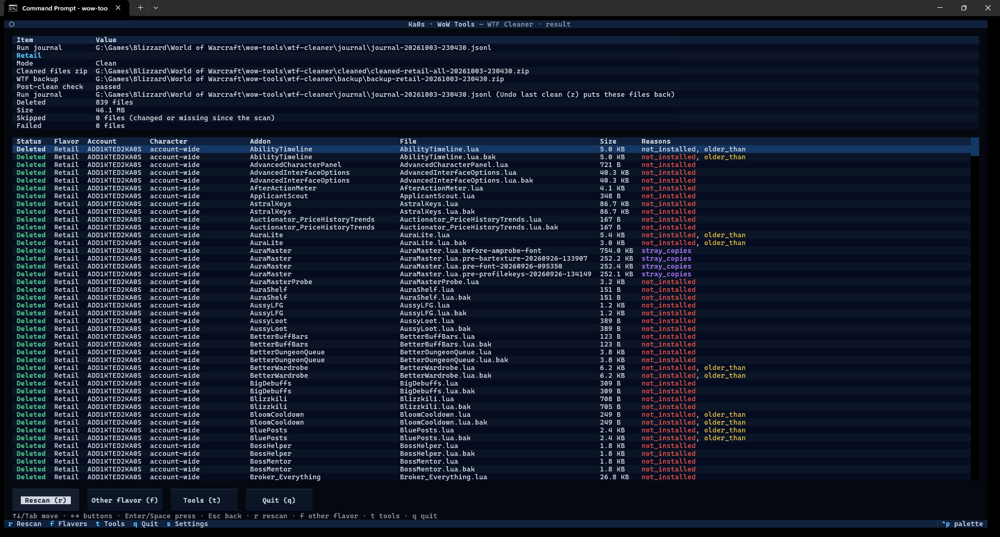

# WTF Cleaner guide

[← Back to the main page](../README.md)

Every addon you install saves its settings in WoW's `WTF` folder, in files called **SavedVariables**. When you
remove an addon, its files stay behind, and after a few years of trying addons out you can easily have hundreds
of them.

The WTF Cleaner finds those leftovers and shows you the list. It backs up the files first and deletes only the
ones you leave ticked. If you regret it later, you can undo the clean.

> **Close WoW before you clean.** WoW rewrites these files when you log out, and it can bring back files you
> just removed. The cleaner warns you if WoW is running.

## Step by step

1. Start Ka0s WoW Tools and choose **WTF Cleaner**.
2. **The first time only:** check the settings (see [Settings](#settings)) and press **Save**. The suggested
   values are fine for most people.
3. **Pick a game version**, or **All flavors** to clean every version at once.
4. If you picked one version that has more than one WoW account, **pick an account**, or **All accounts**.
5. The cleaner scans and shows you the review screen. Look through the list and untick anything you want to
   keep.
6. Press **Dry run** (`y`) if you'd like to see what would happen without deleting anything.
7. Press **Clean** (`w`), read the summary, and press **Yes**.
8. The results screen lists every file and what happened to it.

## The review screen

**_The WTF Cleaner review screen_**


**On the right** is the list of files the cleaner suggests removing, grouped like this:

game version → account → account-wide settings or one character → addon → files

Everything starts ticked, meaning "remove this". Untick an addon, a character or a whole account to keep it.
An account or game version with nothing to remove says "nothing to clean".

**On the left** are the rules that decide what gets suggested, the age limit, and the buttons.

**At the bottom** a bar totals what's ticked (items, files and size), plus scan warnings and any game version
that couldn't be scanned.

### The four rules

A file is suggested if **any** ticked rule matches it. All four are on to start with, and each has its own
colour, used in the list too:

| Rule | Suggests | Example |
|---|---|---|
| **1 Not installed** (red) | Settings for addons that are no longer installed | `OldBagAddon.lua` after you removed that addon |
| **2 Not enabled** (orange) | Settings for addons that are installed but switched off on every character | An addon you disabled everywhere but never removed |
| **3 Older than max age** (yellow) | Addons whose settings haven't changed in a long time (90 days to start with) | An addon from last expansion that you stopped using |
| **4 Stray copies** (purple) | Copies you or another program made by hand next to the real file | `Details.lua - Copy.bak` |

Each rule shows how many files it matches, for example `1 Not installed (672 files)`. Press `1`, `2`, `3` or `4`
to switch a rule on or off. To change the age limit, type a number of days in the **Max age** box and press
Enter.

### What the cleaner never touches

- Blizzard's own settings (any file starting with `Blizzard_`).
- Everything that isn't addon settings: your keybindings, macros, chat setup, UI layout, and the list of enabled
  addons.
- Anything outside the `WTF` folder of the game version you picked.

If a game version has no addons installed at all, the cleaner refuses to scan it, so it can't suggest deleting
everything by mistake. With All flavors, that version shows "not scanned: no addons installed" (the log has the
folder it looked in) and the others carry on.

### Accounts

- **All accounts** (the usual choice): an addon counts as "enabled" if *any* character on *any* account uses it.
- **One account**: only that account's files are scanned, and only its characters count.
- **All flavors**: every game version is scanned in turn, each with all its accounts.

A character that has never changed its addon list counts as having every addon enabled, because that's what WoW
does.

If there are no characters at all (an account, or a whole game version, with only account-wide settings), the
cleaner can't tell what is switched off, so it counts every installed addon as enabled and the "Not enabled" rule
suggests nothing there. The scan notes this in its warnings.

### Keys on the review screen

| Key | Does |
|---|---|
| `Space` | Tick or untick the highlighted line |
| `a` / `n` | Tick / untick every file shown (a file a rule hides keeps its tick) |
| `1` `2` `3` `4` | Switch a rule on or off |
| `w` | **Clean** the ticked files (asks first; the answer starts on **No**) |
| `y` | **Dry run** (asks first; the answer starts on **Yes**) |
| `x` / `c` | Expand every line of the tree / collapse them all |
| `r` | Scan again |
| `z` | **Undo last clean** (asks first; the answer starts on **No**) |
| `f` or `Esc` | Pick another game version |
| `t` | Back to the tool menu |
| `s` | Settings |
| `q` | Quit |
| `←` `→` | Jump between the list and the left panel |
| `Tab` | Move to the next control |

## Cleaning

When you press **Clean**, the bottom bar says "Checking for running programs…" for a moment while the cleaner
looks for WoW and for programs that lock these files. Your ticks and filters can't be changed during that moment,
so what you confirm is exactly what the list shows. Then it asks you to confirm. Once you do, a progress window
shows each step and the file it's working on:

**_A clean in progress_**


Before anything is deleted, the cleaner:

1. **Checks that no other program has the files open.** The Raider.IO client and the WeakAuras Companion are
   known to lock these files. If any file is locked, the clean stops with nothing deleted and tells you which
   ones. Close that program and try again. (It checks by renaming each file to `<name>.wowtools-lockcheck` and
   straight back. If the app is closed in that split second, the next clean puts the file back first, and the
   scan warns about it until then.)
2. **Backs up your whole `WTF` folder** into a zip file and checks the zip. If the backup fails, nothing is
   deleted.
3. **Zips the files it's about to remove** and checks that zip too. If it fails, nothing is deleted.
4. **Starts a journal**, a short record used by **Undo last clean**. If it can't write the journal, nothing is
   deleted.

Then it deletes the files, and finally it compares your `WTF` folder against the backup to make sure only the
right files are gone.

With **All flavors**, the game versions are cleaned one after another, and each gets all the steps above. If one
version runs into a problem, the cleaner stops there, and the versions after it aren't touched.

### The results screen

**_The results of a clean_**



The top table sums up the clean: how many files were deleted, where the zips are, and whether the final check
passed. With All flavors there's a block for each game version. The table below lists every file with what
happened to it, its account, character, addon, size and why it was suggested.

From here, `r` scans again, `f` picks another game version, `t` goes back to the tool menu, and `q` quits.

### Dry run

A **Dry run** does everything a clean does except the deleting. It still writes the zip of the files it *would*
remove (named `dryrun-…zip`, so you can tell it from a real clean's zip), and shows you the same results screen.
When in doubt, do a dry run first. Since dry runs tend to be repeated, only the newest few dry-run zips of each
game version are kept (the same number as WTF backups, 5 unless you change it).

## Undo last clean

Changed your mind? **Undo last clean** (`z`, the amber button) puts back every file the most recent clean
deleted. It asks first and tells you when that clean ran and how many files it removed.

- Files come back from the zip the cleaner made before deleting, or from the backup of your whole `WTF` folder.
- If a file with the same name has appeared since (WoW may have written a new one), it's **left alone**. Undo never
  overwrites anything.
- Undo only goes back **one clean**. After you undo, the button stays greyed out until your next clean.

Close WoW before you undo.

## Where your backups go

Everything the cleaner saves goes into its backup folder. Unless you change it in settings, that's
`<your WoW folder>\wow-tools\wtf-cleaner`:

```
wow-tools\wtf-cleaner\
  backup\backup-<flavor>-<YYYYMMDD-HHMMSS>.zip                 your whole WTF folder, taken before each clean
  cleaned\cleaned-<flavor>-<account>-<YYYYMMDD-HHMMSS>.zip     just the files that clean removed
  cleaned\dryrun-<flavor>-<account>-<YYYYMMDD-HHMMSS>.zip      the files a dry run would have removed
  journal\journal-<YYYYMMDD-HHMMSS>.jsonl                      the record Undo last clean uses
```

`<flavor>` is the game version (`retail`, `classic_era` and so on) and `<account>` is the account you picked, or
`all`. For example: `cleaned-retail-all-20261003-140311.zip`. If two cleans start in the same second, the second
gets `-2` added before `.zip`, so no backup ever replaces another.

- The **cleaned** zips are never deleted by the app.
- Only the newest 10 **backups** of each game version are kept (you can change this in the shared settings, the
  first screen `s` opens; `0` keeps them all).
- Only the newest 10 **dry-run** zips of each game version are kept (the same setting). Dry-run zips made by
  older versions of the app are named `cleaned-…` like real ones, so they're kept until you delete them.
- Only the newest 10 **journals** are kept (also a shared setting).

## Restoring a backup

**Undo last clean** is the easy way. To restore by hand instead (for example an older clean):

- **Some files from a clean:** close WoW, open the `cleaned\cleaned-…zip`, and extract it **into the game
  version's folder** (for example `World of Warcraft\_retail_`), keeping the folders. The files land back where
  they were. You can ignore `manifest.json`.
- **The whole WTF folder:** the same, with a `backup\backup-…zip`. This puts back the whole folder exactly as it
  was before that clean, so only do it if something is really missing.

## If a clean was interrupted

If the app is closed in the middle of a clean (a power cut, or you closed the window), it notices next time. It
**never restores on its own**. Instead it shows a message saying when that clean started and where its backup is:

- **Dismiss (keep the backup)** clears the message and keeps the backup.
- **Remind me next time** shows it again next time.

Until you dismiss it, new cleans are refused (dry runs still work), so the cleaner can't lose track of that
backup.

## Settings

Press `s` in the cleaner (you get the shared settings first, then the cleaner's). The cleaner's settings are saved
in `config\wtf-cleaner.cfg`.

| Setting | Starts as | What it means |
|---|---|---|
| Max age in days | 90 | The age limit for rule 3 |
| The four rules | all on | Which rules are on when the review screen opens |
| Zip the files before deleting | on | Keep a zip of everything a clean removes (recommended) |
| Backup folder | empty | Where zips and backups go. Empty means `<WoW folder>\wow-tools\wtf-cleaner`. It must be a full path, and it can't be your WoW folder itself or inside a game version's `WTF`, `Interface` or `Screenshots` folder |

The file itself uses these names, if you edit it by hand: `max_age_days`, `criterion_not_installed`,
`criterion_not_enabled`, `criterion_older_than`, `criterion_stray_copies`, `backup_before_delete`, `backup_dir`,
`last_account` and `last_flavor_choice`.

Backups and journals to keep are shared by every tool: they're on the first screen `s` opens (the one with
your WoW folder), and saved as `keep_backups` (10; `0` keeps all) and `keep_journals` (10) under `[general]`
in `config\wow-tools.cfg`. The WTF backups and the dry-run zips both follow
`keep_backups`.

## FAQ

| Question | Answer |
|----------|--------|
| What is a SavedVariables file? | The file an addon keeps its settings in, such as `Details.lua`. WoW writes them to the `WTF` folder when you log out. They're safe to delete for addons you no longer use; the addon simply starts with default settings if you ever install it again. |
| Will it delete settings for addons I still use? | Not with the usual rules. Rule 1 only suggests addons that aren't installed, and rule 2 only addons switched off on every character. Rule 3 (older than the age limit) can catch an addon you still have but rarely load, so look through the list and untick anything you want to keep. |
| Does it check whether WoW is running? | Yes, before every clean, for the game versions you're cleaning, and it warns you if WoW is open. This works on Windows, WSL and Linux. On a Mac it can't tell, so close WoW yourself first. |
| Does it touch my keybindings, macros or UI layout? | No. It only ever looks at addon settings files. Blizzard's own settings, keybindings, macros, chat setup, UI layout and your list of enabled addons are never touched. |
| What's the difference between a Dry run and Clean? | A **Dry run** does every step except deleting, so you can see the full results first. **Clean** deletes the ticked files after backing them up. |
| Can I clean one account only? | Yes. Pick a single game version; if it has more than one account, the next screen lets you pick one. |
| How much space do the backups take? | Each WTF backup is a zip of your whole `WTF` folder, so it depends on how big that folder is (zipping shrinks these text files a lot). Only the newest 10 per game version are kept (you can change that in the shared settings; `0` keeps them all), and the same number of dry-run zips. The zips of cleaned files are kept until you delete them. |
| Can I undo a clean from last week? | **Undo last clean** only goes back to the most recent clean. For an older one, unzip its files by hand; see [Restoring a backup](#restoring-a-backup). |

## Troubleshooting

| Symptom | Fix |
|---------|-----|
| Files come back after cleaning | WoW was running. Close it and clean again. |
| "files are locked by another program" | Close the Raider.IO client or the WeakAuras Companion, then clean again. Nothing was deleted. |
| A warning about a `.wowtools-lockcheck` file | The app was closed during a lock check and left a settings file renamed. The next clean renames it back (a clean of one account only fixes that account's files). To fix it now, close WoW and remove `.wowtools-lockcheck` from the end of the name. If the original file is there too, the leftover is an old copy you can delete. |
| "Refusing to scan" | That game version has no addons installed, so there's nothing safe to suggest. |
| "The clean stopped unexpectedly" | Something went wrong that the cleaner didn't expect. Press `r` to scan again and see what's left. If settings you wanted are missing, **Undo last clean** (`z`) or the WTF backup puts them back. Then follow [Reporting a bug](../README.md#reporting-a-bug); the details are in the log. |
| "Backup folder not allowed" | The backup folder in settings is a relative path, your WoW folder, or inside a game version's `WTF`, `Interface` or `Screenshots` folder (a backup inside `WTF` would be zipped into every later backup). Press `s` and pick another folder, or leave it empty for the default. Nothing was cleaned. |
| "An earlier clean did not finish" | See [If a clean was interrupted](#if-a-clean-was-interrupted). |
| **Undo last clean** is greyed out | There's nothing to undo: you haven't cleaned yet, or you already undid the last clean. |
| The scan takes a long time | A big `WTF` folder takes a while, especially from WSL; see the main [Troubleshooting](../README.md#troubleshooting). The progress bar shows it's still working. |
| Something else looks wrong | Follow [Reporting a bug](../README.md#reporting-a-bug) in the main README. |
